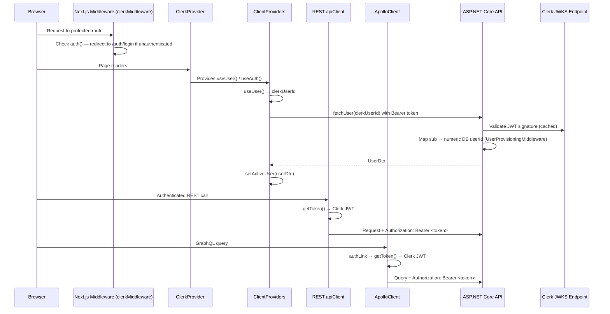
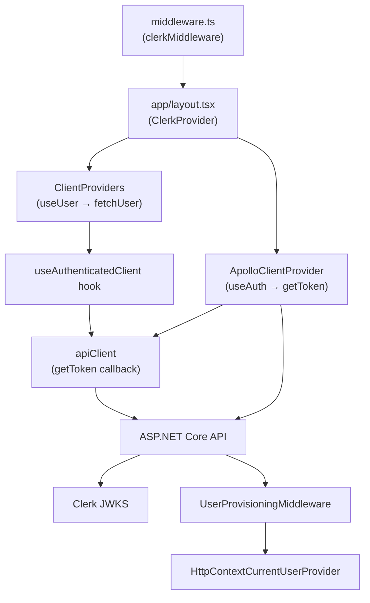

# Design Document: Clerk Auth Integration

## Overview

This feature completes the end-to-end Clerk.js authentication integration for the Koine Greek learning platform. The current state is partially wired: `@clerk/nextjs` is installed and the Apollo GraphQL client already injects Clerk JWTs, but login/signup pages are stubs, the REST `apiClient` never attaches tokens, `ClientProviders` drives user identity from a dev-only numeric ID in `localStorage`, and the backend validates only its own locally-issued JWTs.

The design replaces all of that with a coherent, production-ready auth flow:

- `ClerkProvider` wraps the entire Next.js app in the root layout
- `clerkMiddleware` enforces route-level protection with an explicit public-route matcher
- Login/signup pages use Clerk's **Custom Flow** (`useSignIn` / `useSignUp` hooks) wired into the existing `LoginForm` / `SignUpForm` design system components — Clerk handles all auth logic while the app's own UI, layout, and styling are fully preserved
- The REST `apiClient` accepts a `getToken` callback and injects `Authorization: Bearer` headers
- `ClientProviders` derives identity from `useUser()` instead of `localStorage`
- The ASP.NET Core backend validates Clerk-issued JWTs via JWKS, maps the `sub` claim to a numeric DB user ID, and auto-provisions new users on first sign-in
- The dev story uses Clerk test accounts (bypass code `424242`) rather than mocks

## Architecture

### High-Level Flow



### Component Interaction Map



### Authentication Scheme Strategy (Backend)

The backend runs two named JWT Bearer schemes side-by-side:

| Scheme name | Token issuer | Signing key | Environment |
|---|---|---|---|
| `ClerkJwt` (default) | Clerk Frontend API | JWKS endpoint | All |
| `LocalJwt` | Koine API itself | Symmetric secret | `Development` only |

The default scheme is `ClerkJwt`. `LocalJwt` is registered only when `ASPNETCORE_ENVIRONMENT == Development` and is used exclusively by `DevAuthController` and legacy integration tests.

## Components and Interfaces

### Frontend

#### `app/layout.tsx` — ClerkProvider wrapper

Wraps the entire app in `<ClerkProvider>` with redirect URLs sourced from env vars. Throws a build-time error if `NEXT_PUBLIC_CLERK_PUBLISHABLE_KEY` is absent.

```typescript
// Env vars consumed:
// NEXT_PUBLIC_CLERK_PUBLISHABLE_KEY (required — build error if absent)
// NEXT_PUBLIC_CLERK_SIGN_IN_URL
// NEXT_PUBLIC_CLERK_SIGN_UP_URL
// NEXT_PUBLIC_CLERK_SIGN_IN_FALLBACK_REDIRECT_URL
// NEXT_PUBLIC_CLERK_SIGN_UP_FORCE_REDIRECT_URL
```

#### `middleware.ts` — Route protection

Uses `clerkMiddleware` with an explicit `isPublicRoute` matcher. Never uses a blanket allow-all fallback.

```typescript
// Public routes: /(public)/*, /onboarding
// Protected routes: /(auth)/*
// Redirect authenticated users away from /auth/login and /auth/signup → /reader
// Redirect authenticated users without onboardingComplete metadata → /onboarding
```

#### `app/(public)/auth/login/page.tsx` and `app/(public)/auth/signup/page.tsx`

Wire Clerk's **Custom Flow** hooks into the existing design system components. The pages remain structurally identical — `AuthShell` wrapping `LoginForm` / `SignUpForm` — but the stub `onSubmit` handlers are replaced with real Clerk logic.

**Login page** — uses `useSignIn()` from `@clerk/nextjs`:

```typescript
// The existing LoginForm UI is kept exactly as-is.
// Only the onSubmit handler changes:
const { signIn, setActive } = useSignIn();

async function handleLogin(email: string, password: string): Promise<void> {
  const result = await signIn.create({ identifier: email, password });
  if (result.status === 'complete') {
    await setActive({ session: result.createdSessionId });
    router.push('/reader');
  }
  // Incomplete flows (MFA, etc.) handled via result.status
}
```

**Sign-up page** — uses `useSignUp()` from `@clerk/nextjs`:

```typescript
// The existing SignUpForm UI is kept exactly as-is.
// Only the onSubmit handler changes:
const { signUp, setActive } = useSignUp();

async function handleSignup(email: string, password: string): Promise<void> {
  const result = await signUp.create({ emailAddress: email, password });
  // If email verification required, handle result.status === 'missing_requirements'
  if (result.status === 'complete') {
    await setActive({ session: result.createdSessionId });
    router.push('/onboarding');
  }
}
```

**OAuth buttons** — the existing `OAuthButtons` component in `AuthForms.tsx` renders Google and Apple buttons. These are wired to Clerk's OAuth flow via `signIn.authenticateWithRedirect` / `signUp.authenticateWithRedirect`:

```typescript
// Inside OAuthButtons, replace no-op onClick with:
await signIn.authenticateWithRedirect({
  strategy: 'oauth_google', // or 'oauth_apple'
  redirectUrl: '/sso-callback',
  redirectUrlComplete: '/reader',
});
```

A new `app/(public)/sso-callback/page.tsx` handles the OAuth redirect using `<AuthenticateWithRedirectCallback />` from `@clerk/nextjs`.

**Error handling** — Clerk throws `ClerkAPIResponseError` on failure. The existing `setError` state in `LoginForm` / `SignUpForm` is populated from `err.errors[0].message`, so the existing MUI `<Alert>` error display works without any UI changes.

**No changes to `AuthForms.tsx` or `AuthShell.tsx`** — the design system components are consumed as-is. All Clerk logic lives in the page files.

#### `ClientProviders.tsx` — Clerk identity migration

Replaces `getActiveDevUserId()` / `localStorage` with `useUser()` from `@clerk/nextjs`.

```typescript
interface ClientProvidersProps {
  children: ReactNode;
}

// Behaviour:
// isLoaded === false  → render loading state, do not fetch
// isSignedIn === false → setActiveUser(getDefaultUserState())
// isSignedIn === true  → fetchUser(user.id) with Clerk JWT
```

#### `useAuthenticatedClient` hook — `src/lib/hooks/useAuthenticatedClient.ts`

Provides a pre-bound `apiClient` with `getToken` wired to `useAuth().getToken`.

```typescript
export function useAuthenticatedClient(): typeof apiClient
```

#### `apiClient` — token injection

The existing `apiClient` already accepts an optional `token` parameter on every method. The `useAuthenticatedClient` hook wraps it to call `getToken()` automatically before each request. No persistent storage of tokens.

#### `ApolloClientProvider.tsx` — hardening

Adds a `console.warn` in development when `getToken()` returns `null`. Adds an `onUnauthenticated` handler to the error link that redirects to `/auth/login`.

### Backend

#### `Program.cs` — dual JWT scheme registration

```csharp
// ClerkJwt scheme (default):
builder.Services.AddAuthentication(defaultScheme: "ClerkJwt")
    .AddJwtBearer("ClerkJwt", options => {
        options.Authority = clerkSettings.Issuer;       // validates iss
        options.MetadataAddress = clerkSettings.JwksUrl; // JWKS endpoint
        // validates azp against ClerkSettings.AuthorizedParties
    });

// LocalJwt scheme (Development only):
#if DEBUG
    .AddJwtBearer("LocalJwt", options => { /* existing symmetric key config */ });
#endif
```

#### `ClerkSettings` — `backend/src/Koine.API/Settings/ClerkSettings.cs`

```csharp
public record ClerkSettings(
    string JwksUrl,
    string Issuer,
    string[] AuthorizedParties
);
```

Bound from `ClerkSettings__*` env vars / `appsettings.json`. Startup validation throws if any required field is missing.

#### `UserProvisioningMiddleware` — `backend/src/Koine.API/Middleware/UserProvisioningMiddleware.cs`

Runs after `UseAuthentication()` / `UseAuthorization()`. For authenticated requests:

1. Reads `sub` claim (Clerk user ID string, e.g. `user_abc123`)
2. Calls `IUserRepository.GetByClerkIdAsync(clerkId)`
3. If not found: creates a new `User` record using Clerk email + generated username, returns HTTP 503 on DB failure
4. Stores resolved numeric `userId` in `HttpContext.Items["NumericUserId"]`

#### `HttpContextCurrentUserProvider` — updated

Reads `HttpContext.Items["NumericUserId"]` (set by `UserProvisioningMiddleware`) instead of parsing `ClaimTypes.NameIdentifier` as an integer. Falls back to `X-Dev-User-Id` header only under `#if DEBUG`.

#### `IUserRepository` — new method

```csharp
Task<User?> GetByClerkIdAsync(string clerkId);
Task<User> ProvisionClerkUserAsync(string clerkId, string email, string username);
```

#### `User` domain entity — new field

```csharp
public string? ClerkId { get; set; }  // nullable for backward compat with seeded dev users
```

#### `AuthController` — deprecation

`POST /api/auth/register` returns HTTP 410 Gone once Clerk provisioning is active.

#### `DevAuthController` — unchanged

Remains `#if DEBUG` only. Continues to issue `LocalJwt` tokens for Swagger/NSwag UI testing.

## Data Models

### Backend: `User` entity (updated)

```csharp
public class User
{
    public int Id { get; set; }
    public string? ClerkId { get; set; }       // NEW — Clerk sub claim (user_abc123)
    public string Email { get; set; } = string.Empty;
    public string Username { get; set; } = string.Empty;
    public string PasswordHash { get; set; } = string.Empty; // retained for LocalJwt compat
    public string? DisplayName { get; set; }
    public int TotalExperience { get; set; }
    public DateTime CreatedAt { get; set; }
    public DateTime? LastLogin { get; set; }
    // ... navigation properties unchanged
}
```

A unique index on `ClerkId` (non-null values only) is added via EF migration.

### Backend: `ClerkSettings` configuration record

```csharp
public record ClerkSettings(
    string JwksUrl,       // CLERK_JWKS_URL / ClerkSettings__JwksUrl
    string Issuer,        // CLERK_ISSUER / ClerkSettings__Issuer
    string[] AuthorizedParties  // comma-separated in env, array in config
);
```

### Frontend: `UserContext` — no schema change

The `User` type in `src/lib/types/domain/user.ts` keeps `id: string`. After migration, `id` will hold the Clerk user ID string (`user_abc123`) rather than a numeric string. The `fetchUser` function in `user.ts` will be updated to accept a Clerk ID and pass it through to the backend.

### Frontend: Environment variables (additions)

```
NEXT_PUBLIC_CLERK_SIGN_IN_URL=/auth/login
NEXT_PUBLIC_CLERK_SIGN_UP_URL=/auth/signup
NEXT_PUBLIC_CLERK_SIGN_IN_FALLBACK_REDIRECT_URL=/reader
NEXT_PUBLIC_CLERK_SIGN_UP_FORCE_REDIRECT_URL=/onboarding
```

### Backend: `appsettings.Development.json` additions

```json
{
  "ClerkSettings": {
    "JwksUrl": "https://<your-clerk-instance>.clerk.accounts.dev/.well-known/jwks.json",
    "Issuer": "https://<your-clerk-instance>.clerk.accounts.dev",
    "AuthorizedParties": "http://localhost:3000"
  }
}
```


## Correctness Properties

*A property is a characteristic or behavior that should hold true across all valid executions of a system — essentially, a formal statement about what the system should do. Properties serve as the bridge between human-readable specifications and machine-verifiable correctness guarantees.*

### Property 1: Protected routes always redirect unauthenticated requests

*For any* route path under `/(auth)/` (lessons, reader, study, vocabulary, profile), an unauthenticated request processed by the middleware should result in a redirect response pointing to the sign-in URL, never a 200 pass-through.

**Validates: Requirements 2.1**

---

### Property 2: Public routes always pass through unauthenticated requests

*For any* route path under `/(public)/` or `/onboarding`, an unauthenticated request processed by the middleware should result in a pass-through (no redirect), regardless of the specific path.

**Validates: Requirements 2.2, 2.3**

---

### Property 3: Authenticated users without onboarding are redirected to /onboarding

*For any* authenticated Clerk session where `publicMetadata.onboardingComplete` is absent or false, a request to any protected route under `/(auth)/` should redirect to `/onboarding` rather than serving the requested page.

**Validates: Requirements 4.2**

---

### Property 4: REST client injects Bearer token for any non-null token

*For any* REST request made via `useAuthenticatedClient` where `getToken()` returns a non-null string, the outgoing HTTP request should contain an `Authorization` header with value `Bearer <token>`, and the token value should exactly match what `getToken()` returned.

**Validates: Requirements 5.1, 5.2**

---

### Property 5: Token is never written to persistent browser storage

*For any* REST or GraphQL request made from an authenticated component, no call to `localStorage.setItem`, `sessionStorage.setItem`, or `document.cookie` assignment should occur with a value that contains a JWT (a string matching the `eyJ...` pattern).

**Validates: Requirements 5.5**

---

### Property 6: Apollo client calls getToken before every GraphQL request

*For any* GraphQL operation executed via the Apollo client singleton, `getToken()` should be called exactly once within the `authLink` `setContext` callback before the request is dispatched.

**Validates: Requirements 6.1**

---

### Property 7: Authenticated Clerk user always triggers fetchUser

*For any* render of `ClientProviders` where `useUser()` returns `{ isLoaded: true, isSignedIn: true, user: { id: clerkId } }`, `fetchUser` should be called with that `clerkId` value, and the resulting user should be set as the active user in `UserContext`.

**Validates: Requirements 7.2**

---

### Property 8: Invalid JWT always returns HTTP 401

*For any* request to a protected backend endpoint where the JWT is expired, has an incorrect issuer (`iss`), has an unauthorized authorized party (`azp`), is malformed, or is absent, the backend should return HTTP 401 Unauthorized and never return a 2xx response.

**Validates: Requirements 8.1, 8.2, 8.3, 8.5**

---

### Property 9: Valid Clerk JWT exposes sub claim in HttpContext.User

*For any* valid Clerk-issued JWT presented to the backend, after authentication middleware runs, `HttpContext.User.FindFirst(ClaimTypes.NameIdentifier)?.Value` should equal the `sub` claim value from the JWT.

**Validates: Requirements 8.4**

---

### Property 10: Clerk user ID lookup returns consistent numeric ID per request

*For any* HTTP request where `HttpContextCurrentUserProvider.GetUserId()` is called multiple times, the same numeric DB user ID should be returned on every call within that request, and the underlying repository should be queried at most once (request-scoped caching).

**Validates: Requirements 9.2, 9.4**

---

### Property 11: User provisioning is idempotent

*For any* Clerk user ID, calling the provisioning logic twice (simulating two requests from the same Clerk user) should result in exactly one `Users` record in the database — the second call should find the existing record and return it unchanged.

**Validates: Requirements 10.1, 10.3**

---

### Property 12: Sign-out resets UserContext to guest state

*For any* authenticated session, after `signOut()` completes, the value in `UserContext` should be structurally equal to the object returned by `getDefaultUserState()` — specifically `{ id: 'guest', name: 'Guest', totalExp: 0, ... }`.

**Validates: Requirements 13.3**

---

## Error Handling

### Frontend

**Missing env vars at build time**
- `NEXT_PUBLIC_CLERK_PUBLISHABLE_KEY` absent → throw `Error` in `app/layout.tsx` before rendering, surfacing a clear message in the build log.

**`getToken()` returns null (unauthenticated or token fetch failed)**
- REST client: send request without `Authorization` header; do not throw.
- Apollo client: send request without `Authorization` header; log `console.warn` in development.

**Onboarding API call fails**
- Display inline error message on the onboarding page; retain the user's rank selection so they can retry without re-selecting.
- Do not redirect to `/reader` on failure.

**Apollo `UNAUTHENTICATED` error code**
- The `buildErrorLink` `onUnauthenticated` handler redirects to `/auth/login`.
- Apollo client cache is reset via `_resetApolloClientForTesting()` (or a production-safe equivalent) before redirect.

**Clerk session expires mid-session**
- Apollo error link catches `UNAUTHENTICATED` and redirects to `/auth/login`.
- REST client will receive a 401 from the backend; callers should handle `ApiResult.ok === false` with `status === 401` and redirect.

### Backend

**Missing Clerk configuration at startup**
- `ClerkSettings` validation in `Program.cs` throws `InvalidOperationException` with a descriptive message identifying the missing variable, causing the process to exit with a non-zero status code.
- In `Development`, log a warning if `CLERK_JWKS_URL` is not configured (rather than hard-failing, to allow running without Clerk for pure local dev).

**JWT validation failure**
- ASP.NET Core JWT Bearer middleware returns HTTP 401 automatically for expired, malformed, wrong-issuer, or wrong-azp tokens.
- No additional error body is added; the standard 401 response is sufficient.

**Clerk user ID not found in DB (during `GetUserId()`)**
- `HttpContextCurrentUserProvider` throws `UnauthorizedAccessException` with message `"No user record found for Clerk ID: {clerkId}"`.
- Controllers do not catch this directly; a global exception filter converts `UnauthorizedAccessException` to HTTP 401.

**User provisioning DB failure**
- `UserProvisioningMiddleware` catches `DbUpdateException` and similar, logs the exception via `ILogger`, and short-circuits the pipeline with HTTP 503 Service Unavailable and a JSON body `{ "message": "User provisioning failed. Please try again." }`.

**`POST /api/auth/register` called after deprecation**
- Returns HTTP 410 Gone with body `{ "message": "Registration via this endpoint is deprecated. Users are provisioned automatically on first Clerk sign-in." }`.

## Testing Strategy

### Dual Testing Approach

Both unit tests and property-based tests are required. They are complementary:
- Unit tests catch concrete bugs in specific scenarios and edge cases.
- Property-based tests verify universal correctness across a wide range of generated inputs.

### Frontend Testing (Vitest 4 + Testing Library)

**Property-based testing library**: `fast-check` — well-maintained, TypeScript-native, integrates cleanly with Vitest.

**Unit / example tests**:
- `app/layout.tsx`: renders `ClerkProvider` wrapping children; throws when publishable key is absent.
- `middleware.ts`: authenticated user on `/auth/login` redirects to `/reader`; unauthenticated user on `/reader` redirects to sign-in; `/onboarding` passes through unauthenticated.
- `ClientProviders`: `isLoaded=false` renders loading state; `isSignedIn=false` sets guest state; `isSignedIn=true` calls `fetchUser`.
- `ApolloClientProvider`: `UNAUTHENTICATED` error triggers redirect to `/auth/login`; Apollo cache is reset on sign-out.
- Onboarding page: API failure shows inline error; success redirects to `/reader`.

**Property-based tests** (minimum 100 iterations each):

```
// Feature: clerk-auth-integration, Property 1: Protected routes redirect unauthenticated requests
fc.property(fc.constantFrom('/reader', '/lessons', '/study', '/vocabulary', '/profile'), ...)

// Feature: clerk-auth-integration, Property 2: Public routes pass through unauthenticated requests
fc.property(fc.constantFrom('/welcome', '/auth/login', '/auth/signup', '/onboarding'), ...)

// Feature: clerk-auth-integration, Property 4: REST client injects Bearer token for non-null token
fc.property(fc.string({ minLength: 10 }), async (token) => { ... })

// Feature: clerk-auth-integration, Property 5: Token never written to persistent storage
fc.property(fc.string({ minLength: 10 }), async (token) => { ... })

// Feature: clerk-auth-integration, Property 6: Apollo calls getToken before every request
fc.property(fc.record({ operationName: fc.string() }), async (op) => { ... })

// Feature: clerk-auth-integration, Property 12: Sign-out resets UserContext to guest state
fc.property(fc.record({ id: fc.string(), name: fc.string(), totalExp: fc.integer() }), ...)
```

### Backend Testing (NUnit 4 + Moq)

**Unit / example tests**:
- `HttpContextCurrentUserProvider`: returns numeric ID from `HttpContext.Items`; throws `UnauthorizedAccessException` when no user found; calls repository only once per request (caching).
- `UserProvisioningMiddleware`: creates new user when Clerk ID not found; passes through when user exists; returns 503 on DB failure.
- `AuthController`: `POST /api/auth/register` returns 410.
- `DevAuthController`: available in Debug builds; issues `LocalJwt` tokens.
- JWT validation: valid Clerk JWT passes; expired token returns 401; wrong issuer returns 401; wrong azp returns 401.

**Property-based tests** (minimum 100 iterations each, using `FsCheck` or `CsCheck`):

```
// Feature: clerk-auth-integration, Property 8: Invalid JWT always returns HTTP 401
// Generate random strings that are not valid JWTs, expired JWTs, wrong-issuer JWTs

// Feature: clerk-auth-integration, Property 9: Valid Clerk JWT exposes sub claim
// Generate valid JWT payloads with random sub values, verify claim extraction

// Feature: clerk-auth-integration, Property 10: Clerk user ID lookup is cached per request
// Generate random Clerk IDs, call GetUserId() N times, verify repository called once

// Feature: clerk-auth-integration, Property 11: User provisioning is idempotent
// Generate random Clerk user IDs, call provisioning twice, verify single DB record
```

**Integration tests**:
- Full request pipeline with a real (test) JWT: verify 200 on protected endpoint.
- Full request pipeline with no JWT: verify 401.
- Provisioning middleware: first request creates user; second request reuses existing user.

All backend tests run single-threaded: `dotnet test ... -m:1`.
