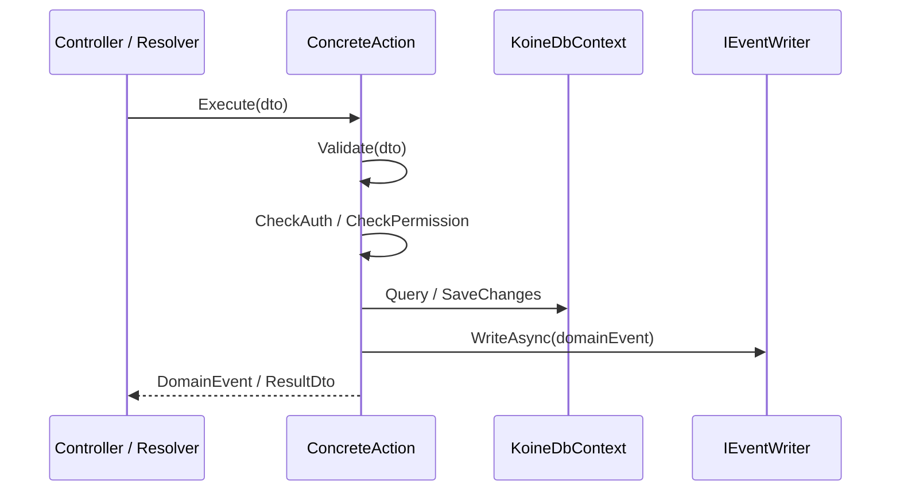
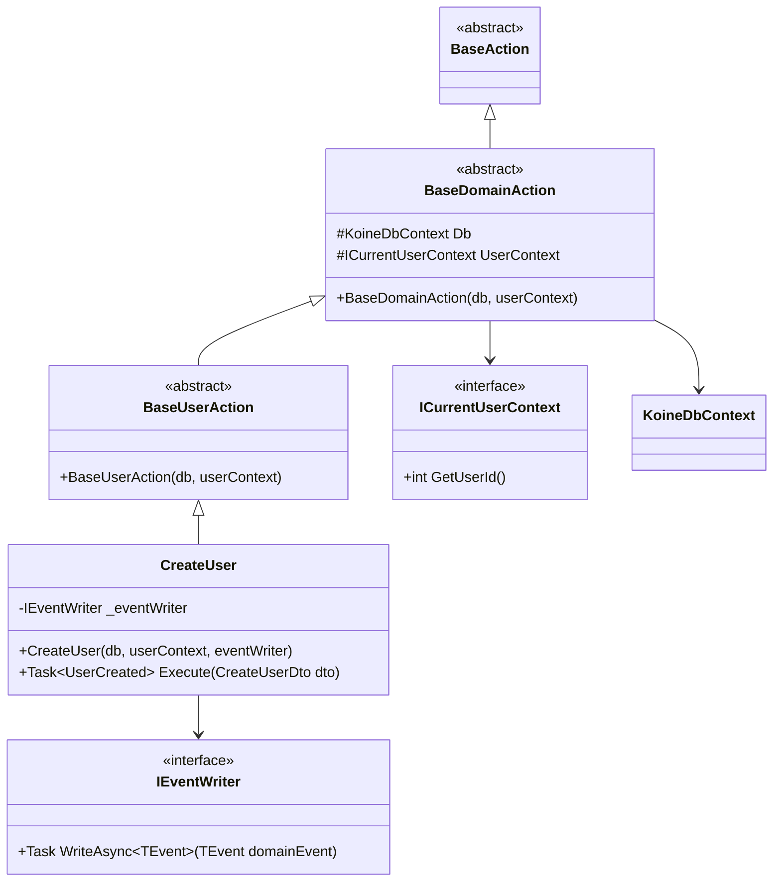

# Design Document: Command Pattern Architecture

## Overview

This design replaces the broad-service pattern (`UserService`, `LessonService`, etc.) with focused, single-responsibility action classes. Each action handles exactly one operation, accepts a strongly-typed DTO, and returns a typed domain event or result DTO — never a raw domain entity.

The pattern is built on a three-level inheritance hierarchy rooted at `BaseAction`. There is no generic base class, no central processor, and no result wrapper type. Cross-cutting concerns (auth, logging, permission checks) are handled inside each action's `Execute` method or via shared helpers on the domain base. Controllers and GraphQL resolvers inject action classes directly and call `Execute` directly.

Migration is incremental: existing services remain functional while new domain areas adopt the pattern, and controllers migrate method-by-method.

---

## Architecture

### Layer Placement

The action classes live entirely in `Koine.Application`, consistent with the existing Clean Architecture constraint (`Domain ← Application ← Infrastructure ← API`). The `Koine.API` layer injects and calls them; the `Koine.Infrastructure` layer is accessed only through `KoineDbContext` (already in Application's dependency graph via EF Core).

```
Koine.Domain        ← entities, enums, value objects
Koine.Application   ← BaseAction, BaseDomainAction, Base{Domain}Action,
                       concrete actions, DTOs, events, IEventWriter
Koine.Infrastructure← KoineDbContext, IEventWriter implementation
Koine.API           ← controllers, GraphQL resolvers, DI wiring
```

### Inheritance Hierarchy

```
BaseAction                          ← plain abstract root, no deps, no generics
  └── BaseDomainAction              ← injects KoineDbContext + ICurrentUserContext
        └── Base{Domain}Action      ← e.g. BaseUserAction, BaseLessonAction
              └── ConcreteAction    ← e.g. CreateUser, UpdateLesson
```

### Request Flow



### Component Diagram



---

## Components and Interfaces

### BaseAction

Plain abstract class. No generic type parameters, no constructor parameters, no methods. Serves as the common root for assembly scanning and DI registration.

```csharp
namespace Koine.Application.Common;

/// <summary>
/// Plain abstract root for all action classes.
/// Provides a common type for assembly scanning and DI registration.
/// </summary>
public abstract class BaseAction { }
```

### BaseDomainAction

Extends `BaseAction`. Injects `KoineDbContext` and `ICurrentUserContext` via constructor and exposes them as `protected readonly` fields. Defines no `Execute` signature and contains no business logic.

```csharp
namespace Koine.Application.Common;

/// <summary>
/// Abstract base for domain actions. Injects shared infrastructure dependencies.
/// </summary>
public abstract class BaseDomainAction : BaseAction
{
    /// <summary>EF Core database context for the current request scope.</summary>
    protected readonly KoineDbContext Db;

    /// <summary>Provides the authenticated user's numeric database ID.</summary>
    protected readonly ICurrentUserContext UserContext;

    protected BaseDomainAction(KoineDbContext db, ICurrentUserContext userContext)
    {
        Db = db;
        UserContext = userContext;
    }

    /// <summary>
    /// Throws <see cref="UnauthorizedException"/> when no authenticated user is present.
    /// Domain bases and concrete actions may call this as a guard.
    /// </summary>
    protected void RequireAuthentication()
    {
        // GetUserId() throws UnauthorizedAccessException when no user is present;
        // we wrap it in our own exception type for consistent HTTP/GraphQL mapping.
        try { UserContext.GetUserId(); }
        catch { throw new UnauthorizedException("Authentication required."); }
    }
}
```

> Note: `ICurrentUserContext` is the application-layer interface backed by `HttpContextCurrentUserProvider` in the API layer. The existing `ICurrentUserProvider` in `Koine.Application.Study.Ports` serves the same purpose; the action layer will reference whichever interface is promoted to the shared Application namespace during implementation.

### Domain-Specific Base Action

One per domain area. Extends `BaseDomainAction`. May inject additional shared dependencies for the domain (e.g. `IEventWriter` if every action in the domain writes events).

```csharp
namespace Koine.Application.UserActions;

/// <summary>
/// Abstract base for all user-domain actions.
/// </summary>
public abstract class BaseUserAction : BaseDomainAction
{
    protected BaseUserAction(KoineDbContext db, ICurrentUserContext userContext)
        : base(db, userContext) { }
}
```

### Concrete Action

Extends the domain base. Defines exactly one `Execute` method with specific input/output types. Validates the DTO, performs auth/permission checks, executes business logic, writes the domain event, and returns it.

```csharp
namespace Koine.Application.UserActions;

/// <summary>
/// Creates a new user account and writes a <see cref="UserCreated"/> event.
/// </summary>
public class CreateUser : BaseUserAction
{
    private readonly IEventWriter _eventWriter;

    public CreateUser(KoineDbContext db, ICurrentUserContext userContext, IEventWriter eventWriter)
        : base(db, userContext)
    {
        _eventWriter = eventWriter;
    }

    /// <summary>
    /// Validates the DTO, creates the user entity, persists it, writes the event, and returns it.
    /// </summary>
    /// <exception cref="ValidationException">Thrown when required fields are missing or invalid.</exception>
    public async Task<UserCreated> Execute(CreateUserDto dto)
    {
        // 1. Validate
        if (string.IsNullOrWhiteSpace(dto.Email))
            throw new ValidationException(nameof(dto.Email), "Email is required.");
        if (string.IsNullOrWhiteSpace(dto.Username))
            throw new ValidationException(nameof(dto.Username), "Username is required.");

        // 2. Create entity
        var user = new User { Email = dto.Email, Username = dto.Username, CreatedAt = DateTime.UtcNow };
        Db.Users.Add(user);

        // 3. Save
        await Db.SaveChangesAsync();

        // 4. Write event
        var evt = new UserCreated(user.Id, user.Email, user.Username);
        await _eventWriter.WriteAsync(evt);

        // 5. Return event
        return evt;
    }
}
```

### IEventWriter

```csharp
namespace Koine.Application.Common;

/// <summary>
/// Persists or publishes a domain event. Implementations live in Koine.Infrastructure.
/// </summary>
public interface IEventWriter
{
    /// <summary>Writes <paramref name="domainEvent"/> to the event store or message bus.</summary>
    Task WriteAsync<TEvent>(TEvent domainEvent);
}
```

### ActionRegistrationExtensions

Assembly-scanning DI registration. Lives in `Koine.Application` so it can be called from `Program.cs` without referencing internals.

```csharp
namespace Koine.Application.Common;

public static class ActionRegistrationExtensions
{
    /// <summary>
    /// Scans Koine.Application for all concrete <see cref="BaseAction"/> subclasses
    /// and registers each as Scoped. Call once from Program.cs.
    /// </summary>
    public static IServiceCollection AddKoineActions(this IServiceCollection services)
    {
        var actionTypes = typeof(BaseAction).Assembly
            .GetTypes()
            .Where(t => t.IsClass && !t.IsAbstract && t.IsSubclassOf(typeof(BaseAction)));

        foreach (var type in actionTypes)
            services.AddScoped(type);

        return services;
    }
}
```

### Exception Types

Defined in `Koine.Application/Common/Exceptions/`. Each carries enough context for HTTP and GraphQL error mapping.

```csharp
// ValidationException — carries field-level errors
public class ValidationException : Exception
{
    public IReadOnlyDictionary<string, string[]> Errors { get; }

    public ValidationException(string field, string message)
        : base($"Validation failed: {field} — {message}")
    {
        Errors = new Dictionary<string, string[]> { [field] = [message] };
    }

    public ValidationException(IReadOnlyDictionary<string, string[]> errors)
        : base("One or more validation errors occurred.")
    {
        Errors = errors;
    }
}

public class UnauthorizedException(string message) : Exception(message);
public class ForbiddenException(string message) : Exception(message);
public class NotFoundException(string resourceType, object id)
    : Exception($"{resourceType} with id '{id}' was not found.");
```

### Controller Integration

Controllers inject concrete action types and call `Execute` directly. Exception mapping is handled per-controller (or via shared middleware — see Error Handling section).

```csharp
[ApiController]
[Route("api/users")]
public class UsersController : ControllerBase
{
    private readonly CreateUser _createUser;
    private readonly ILogger<UsersController> _logger;

    public UsersController(CreateUser createUser, ILogger<UsersController> logger)
    {
        _createUser = createUser;
        _logger = logger;
    }

    [HttpPost]
    public async Task<IActionResult> Create([FromBody] CreateUserDto dto)
    {
        try
        {
            var evt = await _createUser.Execute(dto);
            return CreatedAtAction(nameof(GetById), new { id = evt.UserId }, evt);
        }
        catch (ValidationException ex)   { return BadRequest(new { errors = ex.Errors }); }
        catch (UnauthorizedException)     { return Unauthorized(); }
        catch (ForbiddenException)        { return Forbid(); }
        catch (NotFoundException ex)      { return NotFound(new { message = ex.Message }); }
        catch (Exception ex)
        {
            _logger.LogError(ex, "Unhandled error in {Action}", nameof(Create));
            return StatusCode(500, new { message = "An unexpected error occurred." });
        }
    }
}
```

### GraphQL Resolver Integration

Resolvers inject concrete action types and call `Execute` directly. Exceptions are mapped to `ExecutionError` with typed codes.

```csharp
// Inside RootMutation constructor
Field<NonNullGraphType<UserCreatedType>>("createUser")
    .Argument<NonNullGraphType<CreateUserInputType>>("input", "User details.")
    .AuthorizeWithPolicy("Authenticated")
    .ResolveAsync(async ctx =>
    {
        var input = ctx.GetArgument<CreateUserDto>("input");
        try
        {
            return (object?)await createUser.Execute(input);
        }
        catch (ValidationException ex)
            => throw new ExecutionError(ex.Message) { Code = "VALIDATION_ERROR",
               Data = { ["errors"] = ex.Errors } };
        catch (UnauthorizedException ex)
            => throw new ExecutionError(ex.Message) { Code = "UNAUTHENTICATED" };
        catch (ForbiddenException ex)
            => throw new ExecutionError(ex.Message) { Code = "FORBIDDEN" };
        catch (NotFoundException ex)
            => throw new ExecutionError(ex.Message) { Code = "NOT_FOUND" };
    });
```

---

## Data Models

### File Structure

```
Koine.Application/
  Common/
    BaseAction.cs
    BaseDomainAction.cs
    IEventWriter.cs
    ActionRegistrationExtensions.cs
    Exceptions/
      ValidationException.cs
      UnauthorizedException.cs
      ForbiddenException.cs
      NotFoundException.cs
  UserActions/
    BaseUserAction.cs
    CreateUser.cs
    UpdateUser.cs
    DeleteUser.cs
    Dtos/
      CreateUserDto.cs
      UpdateUserDto.cs
    Events/
      UserCreated.cs
      UserUpdated.cs
      UserDeleted.cs
  LessonActions/
    BaseLessonAction.cs
    CreateLesson.cs
    CompleteLesson.cs
    Dtos/
      CreateLessonDto.cs
      CompleteLessonDto.cs
    Events/
      LessonCreated.cs
      LessonCompleted.cs
  VocabularyActions/
    BaseVocabularyAction.cs
    CreateVocabulary.cs
    ...
```

### DTO Convention

Input DTOs are `record` types. An optional `BaseDto` abstract record may be introduced per domain area to share validation helpers, but it is never enforced via generics.

```csharp
// Koine.Application/UserActions/Dtos/CreateUserDto.cs
namespace Koine.Application.UserActions.Dtos;

/// <summary>Input DTO for the <see cref="CreateUser"/> action.</summary>
public record CreateUserDto(string Email, string Username, string? DisplayName);

// Optional shared base for a domain area
public abstract record BaseUserDto
{
    protected static void RequireNonEmpty(string? value, string field)
    {
        if (string.IsNullOrWhiteSpace(value))
            throw new ValidationException(field, $"{field} must not be empty.");
    }
}
```

### Domain Event Convention

Domain events are `record` types in the `Events/` folder. They describe what happened and carry the data needed by downstream consumers. They are never raw domain entities.

```csharp
// Koine.Application/UserActions/Events/UserCreated.cs
namespace Koine.Application.UserActions.Events;

/// <summary>Raised when a new user account is successfully created.</summary>
public record UserCreated(int UserId, string Email, string Username);

/// <summary>Raised when a user account is updated.</summary>
public record UserUpdated(int UserId, string? Email, string? Username, string? DisplayName);

/// <summary>Raised when a user account is deleted.</summary>
public record UserDeleted(int UserId);
```

---

## Correctness Properties

*A property is a characteristic or behavior that should hold true across all valid executions of a system — essentially, a formal statement about what the system should do. Properties serve as the bridge between human-readable specifications and machine-verifiable correctness guarantees.*

### Property 1: All concrete actions subclass BaseAction

*For any* type in the `Koine.Application` assembly that is a concrete (non-abstract) class and whose name ends in a known action suffix or whose namespace contains `Actions`, that type must be a subclass of `BaseAction`.

**Validates: Requirements 1.2, 2.1**

### Property 2: BaseAction has no constructor parameters and no generic type parameters

*For any* type in the `BaseAction` hierarchy at the root level (`BaseAction` itself), the type must have no generic type parameters and its only constructor must be the default parameterless constructor.

**Validates: Requirements 1.1, 1.4**

### Property 3: Every concrete action has exactly one public Execute method

*For any* concrete `BaseAction` subclass, reflecting on its public instance methods must yield exactly one method named `Execute`.

**Validates: Requirements 2.2**

### Property 4: Execute return types are never raw domain entities

*For any* concrete `BaseAction` subclass, the return type of its `Execute` method (unwrapping `Task<T>`) must not be a type defined in `Koine.Domain.Entities`.

**Validates: Requirements 2.3, 4.3**

### Property 5: Execute return types for mutating actions are record types

*For any* concrete `BaseAction` subclass whose name starts with `Create`, `Update`, or `Delete`, the unwrapped return type of `Execute` must be a `record` type.

**Validates: Requirements 2.7, 4.3**

### Property 6: Input DTO types are record types

*For any* concrete `BaseAction` subclass, the first parameter type of its `Execute` method must be a `record` type.

**Validates: Requirements 3.1**

### Property 7: Invalid DTOs cause ValidationException

*For any* concrete `BaseAction` subclass, calling `Execute` with a DTO that has required fields set to null or whitespace must throw a `ValidationException` before any database or event-writer interaction occurs.

**Validates: Requirements 3.4**

### Property 8: Mutating actions call IEventWriter exactly once

*For any* concrete `BaseAction` subclass whose name starts with `Create`, `Update`, or `Delete`, calling `Execute` with a valid DTO and a mocked `IEventWriter` must result in `WriteAsync` being called exactly once.

**Validates: Requirements 4.2**

### Property 9: IEventWriter exceptions propagate from Execute

*For any* concrete mutating action, if the injected `IEventWriter.WriteAsync` throws an exception, calling `Execute` must propagate that same exception to the caller without swallowing it.

**Validates: Requirements 4.4**

### Property 10: Unauthenticated Execute throws UnauthorizedException

*For any* concrete action that requires authentication, calling `Execute` when `ICurrentUserContext.GetUserId()` throws must result in an `UnauthorizedException` being thrown by `Execute`.

**Validates: Requirements 5.1**

### Property 11: Insufficient-permission Execute throws ForbiddenException

*For any* concrete action that requires a permission check, calling `Execute` with a user that lacks the required permission must result in a `ForbiddenException` being thrown by `Execute`.

**Validates: Requirements 5.2**

### Property 12: DI registration discovers all concrete BaseAction subclasses

*For any* concrete `BaseAction` subclass in the `Koine.Application` assembly, calling `AddKoineActions` on a `ServiceCollection` and building the provider must allow that type to be resolved as a scoped service.

**Validates: Requirements 6.1, 6.4**

### Property 13: Controller maps every known exception type to the correct HTTP status

*For any* controller method that delegates to an action, when `Execute` throws `ValidationException` → 400, `UnauthorizedException` → 401, `ForbiddenException` → 403, `NotFoundException` → 404, or any other exception → 500.

**Validates: Requirements 7.3, 7.4, 7.5, 7.6, 7.7**

### Property 14: GraphQL resolver maps every known exception type to the correct error code

*For any* GraphQL resolver field that delegates to an action, when `Execute` throws `UnauthorizedException` → `"UNAUTHENTICATED"`, `ForbiddenException` → `"FORBIDDEN"`, `NotFoundException` → `"NOT_FOUND"`, `ValidationException` → `"VALIDATION_ERROR"`.

**Validates: Requirements 8.2, 8.3, 8.4, 8.5**

### Property 15: Actions are directly constructable with mocked dependencies

*For any* concrete `BaseAction` subclass, it must be possible to instantiate it by passing mocked objects for each constructor parameter type, without requiring a DI container or application host.

**Validates: Requirements 10.1**

---

## Error Handling

### Exception Hierarchy

All custom exceptions live in `Koine.Application/Common/Exceptions/` and are thrown by action `Execute` methods. Callers (controllers, resolvers) catch and map them.

| Exception | Thrown when | HTTP | GraphQL code |
|---|---|---|---|
| `ValidationException` | DTO fields fail validation | 400 | `VALIDATION_ERROR` |
| `UnauthorizedException` | No authenticated user | 401 | `UNAUTHENTICATED` |
| `ForbiddenException` | User lacks required permission | 403 | `FORBIDDEN` |
| `NotFoundException` | Entity not found by ID | 404 | `NOT_FOUND` |
| Any other | Unexpected failure | 500 | (propagates as unhandled) |

### Mapping Strategy

Two options are available; the design recommends starting with per-controller try/catch (consistent with the existing codebase) and optionally extracting to middleware later:

**Option A — Per-controller try/catch** (recommended for migration phase): Each controller method wraps `Execute` in a try/catch block mapping exceptions to `IActionResult`. This is consistent with the existing `UsersController` pattern and keeps the mapping explicit.

**Option B — Exception-handling middleware**: A single `ActionExceptionMiddleware` catches known exception types and writes the appropriate HTTP response. This reduces boilerplate once the pattern is established across many controllers.

For GraphQL resolvers, the mapping is always inline (per-field) since `ExecutionError` must be thrown from within the resolver lambda.

### IEventWriter Failure

If `IEventWriter.WriteAsync` throws, the exception propagates out of `Execute` to the controller/resolver. The controller returns HTTP 500; the resolver surfaces an unhandled `ExecutionError`. The EF Core `SaveChanges` call that precedes `WriteAsync` will have already committed — implementors should consider transactional outbox patterns if at-least-once delivery is required (out of scope for this spec).

---

## Testing Strategy

### Dual Testing Approach

Both unit tests and property-based tests are required. They are complementary:

- **Unit tests** verify specific examples, integration points, and error conditions.
- **Property tests** verify universal properties across many generated inputs.

### Property-Based Testing

The project already uses **FsCheck 3 + FsCheck.NUnit** (see `Koine.Tests.csproj`). Each correctness property above maps to a single `[Property]` test.

Configuration:
- Minimum **100 iterations** per property test (`MaxTest = 100`).
- Each test carries a comment referencing the design property.
- Tag format: `// Feature: command-pattern-architecture, Property {N}: {property_text}`

Example property test:

```csharp
// Feature: command-pattern-architecture, Property 3: Every concrete action has exactly one Execute method
[Property(MaxTest = 100)]
public Property ConcreteActions_HaveExactlyOneExecuteMethod(PositiveInt seed)
{
    var concreteActions = typeof(BaseAction).Assembly
        .GetTypes()
        .Where(t => t.IsClass && !t.IsAbstract && t.IsSubclassOf(typeof(BaseAction)))
        .ToList();

    var allHaveOneExecute = concreteActions.All(t =>
        t.GetMethods(BindingFlags.Public | BindingFlags.Instance)
         .Count(m => m.Name == "Execute") == 1);

    return Prop.ToProperty(allHaveOneExecute);
}
```

Example unit test for exception mapping:

```csharp
[Test]
public async Task CreateUser_ThrowsValidationException_WhenEmailIsEmpty()
{
    var db = CreateInMemoryDb();
    var userContext = new Mock<ICurrentUserContext>();
    var eventWriter = new Mock<IEventWriter>();

    var action = new CreateUser(db, userContext.Object, eventWriter.Object);

    Assert.ThrowsAsync<ValidationException>(
        () => action.Execute(new CreateUserDto(Email: "", Username: "user", DisplayName: null)));

    eventWriter.Verify(e => e.WriteAsync(It.IsAny<object>()), Times.Never);
}
```

### Unit Test Focus Areas

- Each action: valid input → correct event returned, `WriteAsync` called once.
- Each action: invalid DTO → `ValidationException` thrown, `WriteAsync` not called.
- Each action: unauthenticated → `UnauthorizedException` thrown.
- `ActionRegistrationExtensions`: all concrete action types resolvable from DI.
- Controller exception mapping: each exception type → correct HTTP status.
- GraphQL resolver exception mapping: each exception type → correct error code.

### Test Project

Tests live in `backend/tests/Koine.Tests/Unit/`. Run with:

```bash
dotnet test backend/tests/Koine.Tests/Koine.Tests.csproj -m:1
```

The `-m:1` flag is required (single-threaded) per project convention.
