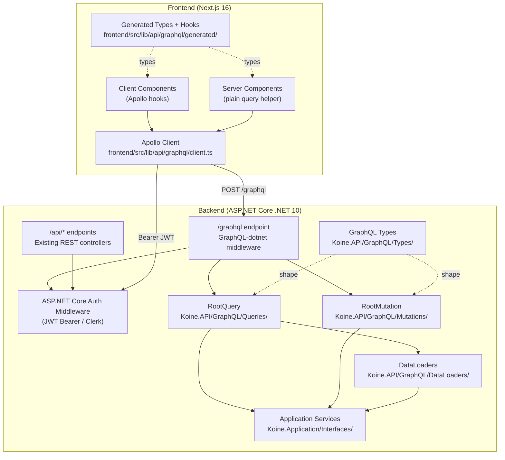

# Design Document: GraphQL Integration

## Overview

This feature adds a GraphQL API layer to the Koine backend using `GraphQL-dotnet` (latest stable) and transitions all frontend features to consume GraphQL via Apollo Client. The GraphQL endpoint coexists with the existing REST controllers throughout the transition — no REST controllers are removed or modified.

The backend exposes a single `/graphql` endpoint that aggregates all domain queries and mutations. The frontend replaces its `src/lib/api/rest/` fetch helpers with typed Apollo hooks generated by `graphql-codegen`. Auth (Clerk JWT Bearer) is preserved end-to-end by reusing the existing ASP.NET Core JWT middleware via `IHttpContextAccessor`.

### Key Design Decisions

- **GraphQL-dotnet (code-first)**: Types and resolvers are defined in C# using the code-first API, keeping the schema in sync with the existing DTO shapes without a separate SDL file to maintain.
- **Coexistence**: The GraphQL middleware is registered additively in `Program.cs` after the existing controller pipeline. No existing middleware order is changed.
- **Auth reuse**: Resolvers read `CurrentUser` from `IHttpContextAccessor` — the same mechanism used by `HttpContextCurrentUserProvider`. No JWT validation logic is duplicated.
- **DataLoaders for N+1**: `ChaptersByBookIdDataLoader`, `WordsByChapterIdDataLoader`, and `GrammaticalFeaturesByIdDataLoader` batch nested field resolution.
- **Apollo Client (frontend)**: A single `ApolloClient` instance is initialised in `frontend/src/lib/api/graphql/client.ts`. Server Components use a plain `HttpLink` without the in-memory cache; Client Components use the cached instance with the `authLink`.
- **Codegen**: `graphql-codegen` with `typescript-react-apollo` generates typed hooks from `.graphql` operation files. Running `npm run codegen` regenerates all types and surfaces schema-breaking changes as TypeScript errors.

---

## Architecture



The GraphQL layer sits entirely in `Koine.API` and delegates all business logic to the existing `Application_Service` interfaces. No new services or repositories are introduced.

---

## Components and Interfaces

### Backend

#### `Koine.API/GraphQL/` folder structure

```
GraphQL/
  Types/
    BookType.cs
    ChapterType.cs
    WordType.cs
    RenderedChapterType.cs
    RenderedUnitType.cs
    VocabularySetType.cs
    VocabularySetItemType.cs
    SessionType.cs
    CardType.cs
    RateCardResultType.cs
    SessionSummaryType.cs
    DashboardType.cs
    ReviewHistoryType.cs
    GrammaticalFeatureType.cs
    SyntacticalFeatureType.cs
    UserProgressType.cs
    LessonType.cs
    LessonTrackType.cs
    LessonCompletionResultType.cs
    InputTypes/
      CreateBookInputType.cs
      UpdateBookInputType.cs
      CreateChapterInputType.cs
      UpdateChapterInputType.cs
      CreateVocabularyInputType.cs
      UpdateVocabularyInputType.cs
      CreateVocabularySetInputType.cs
      StartSessionInputType.cs
      CompleteLessonInputType.cs
      UserProgressInputType.cs
  Queries/
    RootQuery.cs          # aggregates all query fields
  Mutations/
    RootMutation.cs       # aggregates all mutation fields
  DataLoaders/
    ChaptersByBookIdDataLoader.cs
    WordsByChapterIdDataLoader.cs
    GrammaticalFeaturesByIdDataLoader.cs
  Schema/
    KoineSchema.cs        # wires RootQuery + RootMutation
```

#### `KoineSchema`

```csharp
public class KoineSchema : Schema
{
    public KoineSchema(IServiceProvider provider) : base(provider)
    {
        Query = provider.GetRequiredService<RootQuery>();
        Mutation = provider.GetRequiredService<RootMutation>();
    }
}
```

#### `RootQuery` (representative fields)

```csharp
public class RootQuery : ObjectGraphType
{
    public RootQuery(IReaderService reader, IBookService books, IChapterService chapters,
                     IVocabularyService vocab, ILessonService lessons, IProgressService progress,
                     IStudyService study, StudySessionService sessions, IHttpContextAccessor http)
    {
        Field<RenderedChapterType>("reader")
            .Argument<NonNullGraphType<IntGraphType>>("bookId")
            .Argument<NonNullGraphType<IntGraphType>>("chapterNumber")
            .Argument<StringGraphType>("lang")
            .ResolveAsync(ctx => reader.RenderChapterAsync(
                ResolveUserId(http), ctx.GetArgument<int>("bookId"),
                ctx.GetArgument<int>("chapterNumber"), ctx.GetArgument<string>("lang") ?? "en"));

        Field<ListGraphType<BookType>>("books")
            .ResolveAsync(_ => books.GetAllBooksAsync());

        // ... remaining fields follow the same pattern
    }
}
```

#### `RootMutation` (representative fields)

```csharp
public class RootMutation : ObjectGraphType
{
    public RootMutation(StudySessionService sessions, IProgressService progress,
                        ILessonService lessons, IStudyService study,
                        IBookService books, IChapterService chapters,
                        IVocabularyService vocab, IHttpContextAccessor http)
    {
        Field<SessionType>("startStudySession")
            .Argument<NonNullGraphType<StartSessionInputType>>("input")
            .AuthorizeWithPolicy("Authenticated")
            .ResolveAsync(ctx => sessions.StartSessionAsync(
                ctx.GetArgument<StartSessionRequest>("input"), CancellationToken.None));

        Field<BooleanGraphType>("createBook")
            .Argument<NonNullGraphType<CreateBookInputType>>("input")
            .AuthorizeWithPolicy("AdminOnly")
            .ResolveAsync(ctx => books.CreateBookAsync(ctx.GetArgument<CreateBookDto>("input")));

        // ... remaining mutations follow the same pattern
    }
}
```

#### DataLoader interface (representative)

```csharp
public class ChaptersByBookIdDataLoader : BatchDataLoader<int, List<ChapterDto>>
{
    private readonly IChapterService _chapters;

    public ChaptersByBookIdDataLoader(IChapterService chapters, IBatchScheduler scheduler,
                                      DataLoaderOptions? options = null)
        : base(scheduler, options) => _chapters = chapters;

    protected override async Task<IDictionary<int, List<ChapterDto>>> FetchAsync(
        IEnumerable<int> bookIds, CancellationToken ct)
    {
        // Single service call for all bookIds in the batch
        var all = await _chapters.GetChaptersByBookIdsAsync(bookIds);
        return all.GroupBy(c => c.BookId).ToDictionary(g => g.Key, g => g.ToList());
    }
}
```

#### `Program.cs` additions (additive only)

```csharp
// After existing service registrations — no existing lines changed
builder.Services.AddScoped<KoineSchema>();
builder.Services.AddScoped<RootQuery>();
builder.Services.AddScoped<RootMutation>();
builder.Services.AddScoped<ChaptersByBookIdDataLoader>();
builder.Services.AddScoped<WordsByChapterIdDataLoader>();
builder.Services.AddScoped<GrammaticalFeaturesByIdDataLoader>();
// ... all GraphQL types registered as scoped

builder.Services
    .AddGraphQL(b => b
        .AddSchema<KoineSchema>()
        .AddSystemTextJson()
        .AddErrorInfoProvider(opt => opt.ExposeExceptionDetails = app.Environment.IsDevelopment())
        .AddDataLoader()
        .AddGraphTypes(typeof(KoineSchema).Assembly));

// In app pipeline — after app.UseAuthentication(); app.UseAuthorization();
app.UseGraphQL<KoineSchema>("/graphql");
if (app.Environment.IsDevelopment())
    app.UseGraphQLPlayground("/graphql/ui");
```

### Frontend

#### File layout

```
frontend/src/lib/api/graphql/
  client.ts                    # Apollo Client factory (server + client variants)
  queries/
    reader.graphql
    books.graphql
    vocabulary.graphql
    lessons.graphql
    progress.graphql
    study.graphql
  mutations/
    study.graphql
    lessons.graphql
    progress.graphql
    vocabulary-sets.graphql
    admin.graphql
  generated/                   # auto-generated by codegen — do not hand-edit
    index.ts
```

#### `client.ts` interface

```typescript
// Server-side: plain HttpLink, no cache (mirrors rest/client.ts pattern)
export function createServerClient(): ApolloClient<NormalizedCacheObject> { ... }

// Client-side: cached instance with authLink that attaches Clerk JWT
export function getApolloClient(): ApolloClient<NormalizedCacheObject> { ... }
```

The `authLink` reads the Clerk token via `useAuth()` / `getToken()` and injects it as `Authorization: Bearer <token>` on every request, mirroring the existing REST `buildHeaders` pattern.

#### `codegen.ts`

```typescript
import type { CodegenConfig } from '@graphql-codegen/cli';

const config: CodegenConfig = {
  schema: process.env.NEXT_PUBLIC_GRAPHQL_URL ?? 'http://localhost:5001/graphql',
  documents: ['src/lib/api/graphql/**/*.graphql'],
  generates: {
    'src/lib/api/graphql/generated/index.ts': {
      plugins: ['typescript', 'typescript-operations', 'typescript-react-apollo'],
      config: {
        withHooks: true,
        withResultType: true,
        scalars: { UUID: 'string', DateTime: 'string', DateOnly: 'string' },
        nonOptionalTypename: false,
      },
    },
  },
};
export default config;
```

---

## Data Models

### GraphQL Schema (SDL representation)

```graphql
type Book {
  id: Int!
  title: String!
  languageCode: String!
  chapterCount: Int!
  chapters: [Chapter!]!          # resolved via ChaptersByBookIdDataLoader
}

type Chapter {
  id: Int!
  bookId: Int!
  chapterIndex: Int!
  title: String
  words: [Word!]!                # resolved via WordsByChapterIdDataLoader
  createdAt: String!
}

type Word {
  id: Int!
  lemma: String!
  gloss: String
  occurrences: Int!
  grammaticalFeatures: [GrammaticalFeature!]!
}

type GrammaticalFeature {
  id: Int!
  code: String!
  description: String
}

type SyntacticalFeature {
  id: Int!
  code: String!
  description: String
}

type RenderedChapter {
  chapterId: Int!
  title: String!
  units: [RenderedUnit!]!
}

type RenderedUnit {
  type: String!
  text: String
  original: String
  path: String
  hints: [String!]!
  vocabId: Int
  gramFeatureIds: [Int!]!
  synFeatureIds: [Int!]!
  children: [RenderedUnit!]!
}

type VocabularySet {
  id: Int!
  ownerUserId: Int
  isSystem: Boolean!
  slug: String!
  bookId: Int
  title: String!
  description: String!
  items: [VocabularySetItem!]!
  createdAt: String!
  lastPracticed: String
  totalCount: Int!
  knownCount: Int!
  learningCount: Int!
  percentComplete: Float!
}

type VocabularySetItem {
  id: Int!
  vocabularyId: Int!
  root: String!
  gloss: String!
  masteryLevel: Int!
  lastSeen: String
}

type Session {
  id: ID!
  totalCards: Int!
  cardsReviewed: Int!
  startedAt: String!
  completedAt: String
  pool: String!
  direction: String!
  mode: String!
  vocabularySetId: Int
}

type Card {
  sessionCardId: Int!
  vocabularyId: Int!
  position: Int!
  totalCards: Int!
  front: CardFront!
  back: CardBack!
  interactionMode: String!
  choices: [String!]
  direction: String!
}

type CardFront {
  root: String!
  transliteration: String
  partOfSpeech: String
  occurrences: Int
}

type CardBack {
  gloss: String!
}

type RateCardResult {
  nextReviewDate: String!
  scheduledDays: Float!
  newState: String!
  sessionComplete: Boolean!
}

type SessionSummary {
  totalReviewed: Int!
  correctCount: Int!
  correctPercentage: Float!
  xpGained: Int!
  totalExperience: Int!
  firstCompletionReward: Boolean!
}

type Dashboard {
  totalCards: Int!
  dueToday: Int!
  newCards: Int!
  learningCards: Int!
  reviewCards: Int!
  relearningCards: Int!
  currentStreak: Int!
  reviewHistory: [ReviewHistoryPoint!]!
}

type ReviewHistoryPoint {
  date: String!
  count: Int!
}

type UserProgress {
  completedLessonIds: [Int!]!
  totalExperience: Int!
  updatedAt: String!
}

type Lesson {
  id: Int!
  trackId: Int!
  trackSlug: String!
  slug: String!
  title: String!
  lessonIndex: Int!
  contentMarkdown: String!
  lessonType: String!
  grammaticalFeatureIds: [Int!]!
  syntacticalFeatureIds: [Int!]!
  vocabularyIds: [Int!]!
  isCompleted: Boolean!
}

type LessonTrack {
  slug: String!
  title: String!
  lessons: [Lesson!]!
}

type LessonCompletionResult {
  success: Boolean!
  lessonId: Int!
  xpGained: Int
}

# Input types (representative)
input StartSessionInput {
  cardCount: Int
  pool: String!
  direction: String!
  mode: String!
  source: String!
  vocabularySetId: Int
  vocabularyIds: [Int!]
}

input CreateBookInput { title: String!, languageCode: String! }
input UpdateBookInput { title: String, languageCode: String }
input CreateChapterInput { chapterIndex: Int!, title: String }
input UpdateChapterInput { title: String }
input CreateVocabularyInput { lemma: String!, gloss: String, occurrences: Int! }
input UpdateVocabularyInput { lemma: String, gloss: String, occurrences: Int }
input CreateVocabularySetInput { title: String!, description: String!, vocabularyIds: [Int!]! }
input CompleteLessonInput { lessonId: Int!, answers: [String!] }
input UserProgressInput { completedLessonIds: [Int!]!, totalExperience: Int! }
```

### Auth context flow

```
HTTP Request
  → ASP.NET Core Auth Middleware validates JWT
  → IHttpContextAccessor.HttpContext.User populated
  → GraphQL resolver calls ResolveUserId(IHttpContextAccessor)
      → User.FindFirst(ClaimTypes.NameIdentifier)?.Value
      → same claim path as existing REST controllers
```

---

## Correctness Properties

*A property is a characteristic or behavior that should hold true across all valid executions of a system — essentially, a formal statement about what the system should do. Properties serve as the bridge between human-readable specifications and machine-verifiable correctness guarantees.*

### Property 1: Unauthenticated requests are rejected without invoking services

*For any* GraphQL query or mutation field that requires authentication, sending a request without a valid JWT must result in a GraphQL error with extension code `UNAUTHENTICATED`, and the underlying Application Service must not be called.

**Validates: Requirements 1.6, 6.2**

### Property 2: Non-admin users are forbidden from admin mutations

*For any* admin mutation (`createBook`, `updateBook`, `deleteBook`, `createChapter`, `updateChapter`, `deleteChapter`, `createVocabulary`, `updateVocabulary`, `deleteVocabulary`) and any authenticated user whose JWT does not carry the `admin` role, the server must return a GraphQL error with extension code `FORBIDDEN` and must not invoke the underlying Application Service.

**Validates: Requirements 3.18, 6.6**

### Property 3: DataLoader batching eliminates N+1 queries for nested fields

*For any* list of N entities (books or chapters), resolving the nested collection field (`chapters` on books, `words` on chapters) must result in at most one call to the corresponding Application Service, regardless of N. The same invariant holds for `GrammaticalFeature` lookups via `GrammaticalFeaturesByIdDataLoader`.

**Validates: Requirements 5.1, 5.2, 5.3, 5.4, 5.5**

### Property 4: Resolver output is structurally equivalent to Application Service output

*For any* valid GraphQL query (reader, books, book, chapters, vocabulary, lessons, progress, studySets, studyDashboard) and any set of arguments, the data returned by the resolver must be structurally equivalent to the data returned by the corresponding Application Service method invoked with the same arguments.

**Validates: Requirements 2.2, 2.3, 2.4, 2.5, 2.6, 2.7, 2.8, 2.9, 2.10**

### Property 5: Invalid mutation inputs are rejected before service invocation

*For any* mutation input that violates field constraints (missing required fields, out-of-range values, wrong types), the server must return a GraphQL error with code `BAD_USER_INPUT` and must not invoke the underlying Application Service.

**Validates: Requirements 3.19**

### Property 6: CurrentUser claim extraction is consistent across GraphQL and REST

*For any* valid JWT, the integer user ID extracted by a GraphQL resolver via `IHttpContextAccessor` and `ClaimTypes.NameIdentifier` must equal the user ID extracted by the equivalent REST controller using the same claim path.

**Validates: Requirements 6.3, 6.5**

### Property 7: REST endpoints are unaffected by GraphQL middleware registration

*For any* existing REST endpoint (`/api/*`), the HTTP response produced after GraphQL middleware is registered must be identical to the response produced before registration — same status code, same body shape, same headers.

**Validates: Requirements 15.1, 15.4**

### Property 8: Apollo authLink attaches the Clerk JWT on every request

*For any* authenticated frontend context where a Clerk JWT is available, every GraphQL request dispatched by the Apollo Client must include an `Authorization: Bearer <token>` header containing that JWT.

**Validates: Requirements 7.3**

### Property 9: Codegen schema round-trip — breaking changes surface as TypeScript errors

*For any* `.graphql` operation file, if the GraphQL server schema changes in a way that is incompatible with that operation, running `npm run codegen` followed by `tsc --noEmit` must produce at least one TypeScript compile error. Conversely, for any compatible schema, the generated types must be assignable to the actual runtime response shape, and the generated file must contain no `any` types.

**Validates: Requirements 8.2, 8.3, 8.5**

### Property 10: GraphQL error codes are propagated to the calling component

*For any* GraphQL response that contains an error with extension code `UNAUTHENTICATED`, `NOT_FOUND`, or `FORBIDDEN`, the Apollo Client must surface that code in the `error` return value of the hook or query helper, and the frontend must render the corresponding UI state (redirect to login, not-found, or access-denied respectively). Network errors must also be surfaced via the `error` return value and logged via `console.error`.

**Validates: Requirements 14.1, 14.2, 14.3, 14.4, 14.5, 14.6**

### Property 11: mapRenderedUnitsToDisplayUnits produces identical output from GraphQL and REST payloads

*For any* chapter rendered by `IReaderService.RenderChapterAsync`, applying `mapRenderedUnitsToDisplayUnits` to the units array from the GraphQL response must produce a result that is deeply equal to applying the same function to the equivalent REST response payload.

**Validates: Requirements 9.3**

### Property 12: CORS headers are present on GraphQL endpoint responses

*For any* cross-origin request to `/graphql` from an allowed origin, the response must include the same CORS headers (`Access-Control-Allow-Origin`, `Access-Control-Allow-Methods`, `Access-Control-Allow-Headers`) as a cross-origin request to `/api/*` from the same origin.

**Validates: Requirements 15.3**

---

## Error Handling

### Backend error codes

| Scenario | GraphQL error code | HTTP status |
|---|---|---|
| No JWT / invalid JWT on protected field | `UNAUTHENTICATED` | 200 (GraphQL envelope) |
| Valid JWT, missing `admin` role on admin mutation | `FORBIDDEN` | 200 |
| Resource not found (nullable field) | returns `null` | 200 |
| Resource not found (non-nullable field) | `NOT_FOUND` | 200 |
| Invalid mutation input | `BAD_USER_INPUT` | 200 |
| Unhandled exception | `INTERNAL_SERVER_ERROR` (detail hidden in prod) | 200 |

GraphQL-dotnet's `IErrorInfoProvider` is configured to expose exception details only in the Development environment, matching the existing REST error behaviour.

### Frontend error handling

The Apollo Client `errorLink` inspects `graphQLErrors` and `networkError`:

- `UNAUTHENTICATED` → redirect to Clerk sign-in (same path as REST 401 handling)
- `NOT_FOUND` → render not-found UI state
- `FORBIDDEN` → render access-denied UI state
- Network error → surface via Apollo's `error` return value; component renders error state
- All errors are logged via `console.error`, matching the pattern in `rest/client.ts`

Feature components that previously checked `result.ok === false` on REST responses will instead check the `error` field returned by Apollo hooks.

---

## Testing Strategy

### Dual Testing Approach

Both unit tests and property-based tests are required. Unit tests catch concrete bugs at specific inputs; property-based tests verify universal correctness across all inputs. They are complementary.

### Backend

**Unit tests** (NUnit 4 + Moq, `backend/tests/Koine.Tests/Unit/GraphQL/`):

- One test class per resolver group (e.g. `BookQueryResolverTests`, `AdminMutationTests`, `DataLoaderTests`)
- Mock `IBookService`, `IChapterService`, etc. via Moq
- Specific examples: schema introspection verifies all expected root fields exist (Requirements 2.1, 3.1, 4.1–4.9)
- Specific examples: Development environment serves Playground at `/graphql/ui`; Production does not (Requirements 1.2, 1.3)
- Specific examples: `/graphql` accepts POST with valid GraphQL body and returns a response envelope (Requirement 1.1)

**Property-based tests** (NUnit 4 + FsCheck, `backend/tests/Koine.Tests/Unit/GraphQL/`):

Each property test runs a minimum of 100 iterations via FsCheck's `Prop.ForAll`.

- `// Feature: graphql-integration, Property 1: Unauthenticated requests are rejected without invoking services`
  — generate random protected field names; assert UNAUTHENTICATED returned and service mock never called
- `// Feature: graphql-integration, Property 2: Non-admin users are forbidden from admin mutations`
  — generate random admin mutation names and random non-admin role claims; assert FORBIDDEN and service not called
- `// Feature: graphql-integration, Property 3: DataLoader batching eliminates N+1 queries for nested fields`
  — generate random lists of N books/chapters; assert service call count = 1 regardless of N using invocation-counting stubs
- `// Feature: graphql-integration, Property 4: Resolver output is structurally equivalent to Application Service output`
  — generate random query arguments; assert resolver result deep-equals service mock return value
- `// Feature: graphql-integration, Property 5: Invalid mutation inputs are rejected before service invocation`
  — generate random invalid input objects; assert BAD_USER_INPUT and service not called
- `// Feature: graphql-integration, Property 6: CurrentUser claim extraction is consistent across GraphQL and REST`
  — generate random JWT payloads with NameIdentifier claims; assert GraphQL resolver and REST controller extract identical user IDs
- `// Feature: graphql-integration, Property 7: REST endpoints are unaffected by GraphQL middleware registration`
  — generate random REST endpoint paths and request bodies; assert response is identical with and without GraphQL middleware

### Frontend

**Unit tests** (Vitest 4 + Testing Library, `frontend/src/lib/api/graphql/`):

- `client.test.ts`: specific examples verifying server client omits in-memory cache; client instance is a singleton
- Operation smoke tests: mock Apollo provider, assert each generated hook returns the expected data shape
- Error handling examples: mock Apollo responses for each error code (`UNAUTHENTICATED`, `NOT_FOUND`, `FORBIDDEN`), assert correct UI branch is rendered
- Codegen configuration example: assert `codegen.ts` specifies all three required plugins and `withHooks: true`
- Coexistence example: assert `rest/client.ts` still exports `apiClient` after GraphQL client is added (Requirement 7.6, 15.5)

**Property-based tests** (Vitest 4 + fast-check, `frontend/src/lib/api/graphql/`):

Each property test runs a minimum of 100 iterations.

- `// Feature: graphql-integration, Property 8: Apollo authLink attaches the Clerk JWT on every request`
  — generate random JWT strings; assert every outgoing request header contains `Authorization: Bearer <token>`
- `// Feature: graphql-integration, Property 9: Codegen schema round-trip — breaking changes surface as TypeScript errors`
  — enforced at build time: `npm run codegen && tsc --noEmit` in CI; any `any` in generated output fails the check
- `// Feature: graphql-integration, Property 10: GraphQL error codes are propagated to the calling component`
  — generate random GraphQL error arrays with known extension codes; assert `errorLink` maps each to the correct UI state and calls `console.error`
- `// Feature: graphql-integration, Property 11: mapRenderedUnitsToDisplayUnits produces identical output from GraphQL and REST payloads`
  — generate random `RenderedUnit` trees; assert `mapRenderedUnitsToDisplayUnits` output is deeply equal whether the input came from the GraphQL or REST response shape
- `// Feature: graphql-integration, Property 12: CORS headers are present on GraphQL endpoint responses`
  — generate random allowed-origin values; assert `/graphql` responses include the same CORS headers as `/api/*` responses for the same origin
