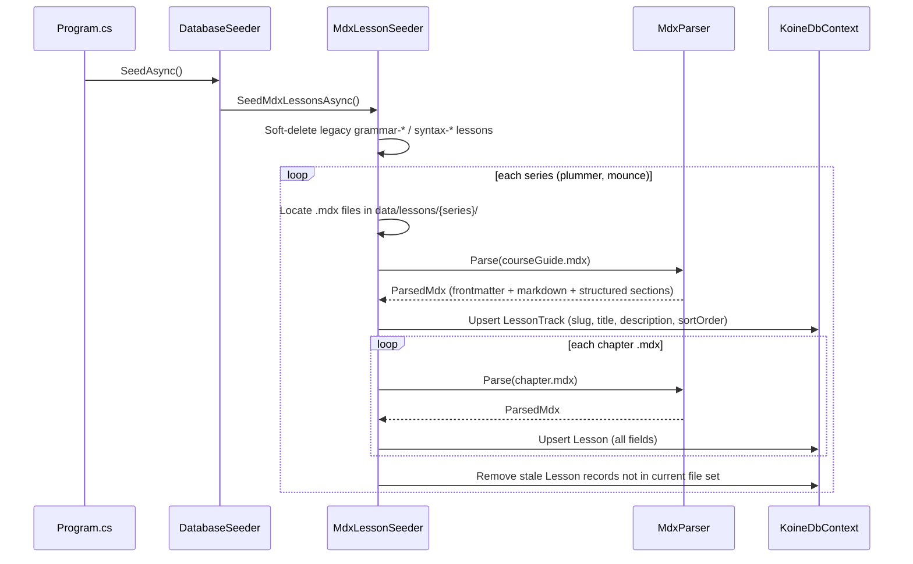
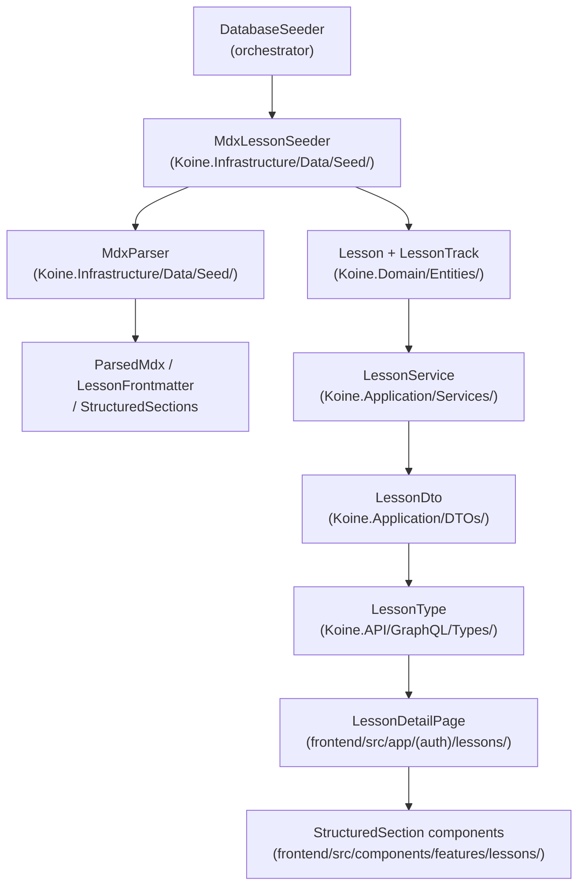

# Design Document: Lesson Content Seeding

## Overview

Replace the current feature-code-driven lesson generation with textbook-chapter-driven lessons sourced from human-authored MDX files in `data/lessons/`. Two series — `plummer/` (24 chapters + course guide) and `mounce/` (33 chapters + course guide) — each map to a `LessonTrack`. At seed time, each MDX file is parsed, its frontmatter metadata is stored on the `Lesson` entity, and its body is converted to clean markdown (JSX stripped). Structured section data (video embed, external lecture link, checklist, resources) is extracted from JSX component props and stored as a separate JSON field (`Lesson.StructuredSectionsJson`). The frontend renders dedicated MUI components for each section type. Legacy feature-code-driven lessons are soft-deleted rather than physically removed.

## Architecture

### High-Level Flow



### Component Map



## Components and Interfaces

### Backend

#### `MdxParser` — `Koine.Infrastructure/Data/Seed/MdxParser.cs`

Stateless utility class. Accepts a raw MDX file string and returns a `ParsedMdx` record.

```csharp
public record LessonFrontmatter(
    string Title,
    string Series,
    int Chapter,
    string? Description,
    int? EstimatedMinutes,
    int? VocabularyCount,
    List<string> Tags,
    List<string> Objectives
);

public record VideoEmbedSection(string VideoId, string Title);
public record ExternalLectureSection(string Url, string Label, string? Instructor);
public record ChecklistSection(List<string> Items);
public record ResourceItem(string Label, string Url, string? Description);
public record ResourcesSection(List<ResourceItem> Items);

public record StructuredSections(
    VideoEmbedSection? VideoEmbed,
    ExternalLectureSection? ExternalLecture,
    ChecklistSection? Checklist,
    ResourcesSection? Resources
);

public record ParsedMdx(
    LessonFrontmatter Frontmatter,
    string ContentMarkdown,       // prose + tables only; no JSX
    StructuredSections Sections
);

public static class MdxParser
{
    /// <summary>
    /// Parses an MDX file string into frontmatter, clean markdown, and structured sections.
    /// Returns null if frontmatter is malformed.
    /// </summary>
    public static ParsedMdx? TryParse(string mdxContent);
}
```

**Parsing algorithm:**

1. Extract the YAML block between the first `---` pair using a regex; deserialize with `YamlDotNet`.
2. Strip the frontmatter block from the body.
3. Strip all `import { ... } from '...'` lines.
4. For each known JSX component (`<YouTubeEmbed>`, `<LectureLinkBanner>`, `<ProgressChecklist>`, `<AdditionalResources>`, `<AttributionNote>`):
   - Extract props using regex (component-specific patterns).
   - Store extracted data in the appropriate `StructuredSections` field.
   - Remove the entire component call (opening tag through closing tag or self-close) from the body.
5. Trim leading/trailing blank lines from the resulting body.
6. Return `ParsedMdx` with the clean markdown and populated `StructuredSections`.

**Idempotency:** The parser is pure — same input always produces same output. No side effects.

#### `MdxLessonSeeder` — `Koine.Infrastructure/Data/Seed/MdxLessonSeeder.cs`

Injected into `DatabaseSeeder`. Resolves the `data/lessons/` path relative to the application's content root.

```csharp
public class MdxLessonSeeder
{
    private readonly KoineDbContext _context;
    private readonly ILogger _logger;
    private readonly string _lessonsRootPath; // resolved from IWebHostEnvironment or config

    public async Task SeedAsync();
}
```

**Seed algorithm:**

1. Soft-delete legacy lessons: `UPDATE Lessons SET DeletedAt = NOW() WHERE Slug LIKE 'grammar-%' OR Slug LIKE 'syntax-%' AND DeletedAt IS NULL`.
2. For each series `["plummer", "mounce"]` with sort orders `[1, 2]`:
   a. Locate all `.mdx` files in `data/lessons/{series}/`, sorted by filename.
   b. Parse `00-course-guide.mdx` → upsert `LessonTrack` (slug, title from frontmatter, description from frontmatter, sortOrder).
   c. For each non-course-guide `.mdx` file:
      - Call `MdxParser.TryParse()`; if null, log warning and skip.
      - Derive slug: `{series}-{filename-stem}` (e.g. `plummer-01-alphabet-pronunciation`).
      - Upsert `Lesson` with all fields (see domain model below).
   d. Seed the course guide itself as a `Lesson` with `LessonIndex = 0`, `LessonType = "course-guide"`, slug `{series}-00-course-guide`.
   e. Collect all expected slugs; soft-delete any `Lesson` in this track whose slug is not in the set and `DeletedAt` is null.

#### `Lesson` entity — updated `Koine.Domain/Entities/Lesson.cs`

New columns added (all nullable for backward compatibility):

```csharp
public string? Description { get; set; }
public int? EstimatedMinutes { get; set; }
public int? VocabularyCount { get; set; }
public string? TagsJson { get; set; }           // JSON array of strings
public string? ObjectivesJson { get; set; }     // JSON array of strings
public string? StructuredSectionsJson { get; set; }  // serialized StructuredSections
public DateTime? DeletedAt { get; set; }        // soft-delete timestamp
```

#### `KoineDbContext` — global query filter

```csharp
modelBuilder.Entity<Lesson>()
    .HasQueryFilter(l => l.DeletedAt == null);
```

This automatically excludes soft-deleted lessons from all normal queries without any call-site changes.

#### EF Migration

One migration: `AddMdxLessonFields`. Adds the seven new nullable columns to the `Lessons` table. No data loss on existing rows.

#### `LessonDto` — extended `Koine.Application/DTOs/Lessons/LessonDto.cs`

```csharp
public string? Description { get; set; }
public int? EstimatedMinutes { get; set; }
public int? VocabularyCount { get; set; }
public List<string> Tags { get; set; } = new();
public List<string> Objectives { get; set; } = new();
public StructuredSectionsDto StructuredSections { get; set; } = new();
```

`StructuredSectionsDto` mirrors the backend `StructuredSections` record but lives in `Koine.Application/DTOs/Lessons/`:

```csharp
public record VideoEmbedDto(string VideoId, string Title);
public record ExternalLectureDto(string Url, string Label, string? Instructor);
public record ChecklistDto(List<string> Items);
public record ResourceItemDto(string Label, string Url, string? Description);
public record ResourcesDto(List<ResourceItemDto> Items);

public class StructuredSectionsDto
{
    public VideoEmbedDto? VideoEmbed { get; set; }
    public ExternalLectureDto? ExternalLecture { get; set; }
    public ChecklistDto? Checklist { get; set; }
    public ResourcesDto? Resources { get; set; }
}
```

#### `LessonService.MapLesson` — updated

Deserializes the new JSON fields when mapping `Lesson` → `LessonDto`:

```csharp
Description = lesson.Description,
EstimatedMinutes = lesson.EstimatedMinutes,
VocabularyCount = lesson.VocabularyCount,
Tags = JsonSerializer.Deserialize<List<string>>(lesson.TagsJson ?? "[]") ?? new(),
Objectives = JsonSerializer.Deserialize<List<string>>(lesson.ObjectivesJson ?? "[]") ?? new(),
StructuredSections = lesson.StructuredSectionsJson is not null
    ? JsonSerializer.Deserialize<StructuredSectionsDto>(lesson.StructuredSectionsJson) ?? new()
    : new()
```

#### `LessonType` GraphQL type — extended

New fields added to `Koine.API/GraphQL/Types/LessonType.cs`:

```csharp
Field<StringGraphType>("description").Resolve(ctx => ctx.Source.Description);
Field<IntGraphType>("estimatedMinutes").Resolve(ctx => ctx.Source.EstimatedMinutes);
Field<IntGraphType>("vocabularyCount").Resolve(ctx => ctx.Source.VocabularyCount);
Field<NonNullGraphType<ListGraphType<NonNullGraphType<StringGraphType>>>>("tags")
    .Resolve(ctx => ctx.Source.Tags);
Field<NonNullGraphType<ListGraphType<NonNullGraphType<StringGraphType>>>>("objectives")
    .Resolve(ctx => ctx.Source.Objectives);
Field<NonNullGraphType<StructuredSectionsType>>("structuredSections")
    .Resolve(ctx => ctx.Source.StructuredSections);
```

New GraphQL types in `Koine.API/GraphQL/Types/`:
- `StructuredSectionsType` — wraps `StructuredSectionsDto`
- `VideoEmbedType`, `ExternalLectureType`, `ChecklistType`, `ResourcesType`, `ResourceItemType`

No new query fields are required — existing queries (`lessonById`, `lessonsByTrack`, `lessonTracks`, `nextLesson`, `userLessons`) automatically expose the new fields.

#### `DatabaseSeeder` — updated

Remove `EnsureTrackLessonsAsync` and its grammar/syntax generation logic. Replace the `EnsureLessonTracksAndLessonsAsync` call with `MdxLessonSeeder.SeedAsync()`.

### Frontend

#### Structured section components — `frontend/src/components/features/lessons/`

Four new components, all using MUI theme tokens:

**`VideoEmbed.tsx`**
```typescript
interface VideoEmbedProps {
  videoId: string;
  title: string;
}
// Renders a responsive 16:9 iframe embed for YouTube
// Uses Box with paddingTop: '56.25%' (aspect ratio trick) + position absolute iframe
```

**`ExternalLecture.tsx`**
```typescript
interface ExternalLectureProps {
  url: string;
  label: string;
  instructor?: string | null;
}
// Renders a styled MUI Card with a link icon, label, and optional instructor attribution
```

**`Checklist.tsx`**
```typescript
interface ChecklistProps {
  items: string[];
}
// Renders a MUI List with CheckCircleOutline icons and typography
```

**`Resources.tsx`**
```typescript
interface ResourceItem {
  label: string;
  url: string;
  description?: string | null;
}
interface ResourcesProps {
  items: ResourceItem[];
}
// Renders a MUI List of external links with optional description text
```

All four components are named exports from `frontend/src/components/features/lessons/index.ts`.

#### `LessonDetailPage` — updated

The existing lesson detail page at `frontend/src/app/(auth)/lessons/tracks/[trackSlug]/[lessonId]/page.tsx` is updated to:

1. Consume the new `structuredSections`, `description`, `estimatedMinutes`, `tags`, and `objectives` fields from the GraphQL query.
2. Render structured section components conditionally:

```typescript
const { videoEmbed, externalLecture, checklist, resources } = lesson.structuredSections ?? {};

// Render order: VideoEmbed → ExternalLecture → prose markdown → Checklist → Resources
{videoEmbed && <VideoEmbed videoId={videoEmbed.videoId} title={videoEmbed.title} />}
{externalLecture && <ExternalLecture url={externalLecture.url} label={externalLecture.label} instructor={externalLecture.instructor} />}
<TextBlock content={lessonContentHtml} />
{checklist?.items?.length > 0 && <Checklist items={checklist.items} />}
{resources?.items?.length > 0 && <Resources items={resources.items} />}
```

3. Show lesson metadata (description, estimated time, tags) in a header area above the content.

#### GraphQL query update

The `GetLessonById` query document is extended to include the new fields:

```graphql
query GetLessonById($id: Int!) {
  lessonById(id: $id) {
    id
    trackId
    trackSlug
    slug
    title
    lessonIndex
    lessonType
    contentMarkdown
    isCompleted
    description
    estimatedMinutes
    vocabularyCount
    tags
    objectives
    structuredSections {
      videoEmbed { videoId title }
      externalLecture { url label instructor }
      checklist { items }
      resources { items { label url description } }
    }
  }
}
```

After updating the query, regenerate the TypeScript types: `nswag run backend/nswa.json` (or the GraphQL codegen equivalent).

## Data Models

### `Lesson` entity (full updated shape)

```csharp
public class Lesson
{
    public int Id { get; set; }
    public int TrackId { get; set; }
    public string Slug { get; set; } = string.Empty;
    public string Title { get; set; } = string.Empty;
    public int LessonIndex { get; set; }
    public string ContentMarkdown { get; set; } = string.Empty;
    public string? ContentPath { get; set; }
    public string LessonType { get; set; } = string.Empty;
    public string GrammaticalFeatureIdsJson { get; set; } = "[]";
    public string SyntacticalFeatureIdsJson { get; set; } = "[]";
    public string VocabularyIdsJson { get; set; } = "[]";
    // NEW:
    public string? Description { get; set; }
    public int? EstimatedMinutes { get; set; }
    public int? VocabularyCount { get; set; }
    public string? TagsJson { get; set; }
    public string? ObjectivesJson { get; set; }
    public string? StructuredSectionsJson { get; set; }
    public DateTime? DeletedAt { get; set; }
    public DateTime CreatedAt { get; set; }

    public virtual LessonTrack? Track { get; set; }
    public virtual ICollection<LessonCompletion> Completions { get; set; } = new List<LessonCompletion>();
}
```

### `LessonTrack` entity — no schema change

The existing `LessonTrack` entity is unchanged. The seeder upserts tracks by slug.

### MDX frontmatter schema (both series)

| Field | Type | Required | Notes |
|---|---|---|---|
| `title` | string | yes | Stored in `Lesson.Title` |
| `series` | string | yes | `"plummer"` or `"mounce"` |
| `chapter` | int | yes | Stored in `Lesson.LessonIndex`; `0` = course guide |
| `description` | string | no | Stored in `Lesson.Description` |
| `estimatedMinutes` | int | no | Stored in `Lesson.EstimatedMinutes` |
| `vocabularyCount` | int | no | Stored in `Lesson.VocabularyCount` |
| `tags` | string[] | no | Serialized to `Lesson.TagsJson` |
| `objectives` | string[] | no | Serialized to `Lesson.ObjectivesJson` |

### JSX component → `StructuredSections` mapping

| JSX Component | Series | Extracted to |
|---|---|---|
| `<YouTubeEmbed videoId="..." title="..." />` | plummer | `StructuredSections.VideoEmbed` |
| `<LectureLinkBanner url="..." label="..." instructor="..." />` | mounce | `StructuredSections.ExternalLecture` |
| `<ProgressChecklist items={[...]} />` | both | `StructuredSections.Checklist` |
| `<AdditionalResources items={[...]} />` | both | `StructuredSections.Resources` |
| `<AttributionNote ... />` | plummer | stripped, not stored |

### `StructuredSectionsJson` example (stored in DB)

```json
{
  "videoEmbed": { "videoId": "BNTG_CH01_PLACEHOLDER", "title": "BNTG Chapter 1 Overview" },
  "checklist": { "items": ["I can write all 24 Greek letters", "I know the two breathing marks"] },
  "resources": {
    "items": [
      { "label": "Daily Dose of Greek", "url": "https://dailydoseofgreek.com/learn-biblical-greek/", "description": "All 24 BNTG chapter overview videos" }
    ]
  }
}
```

## Correctness Properties

### Property 1: MdxParser is idempotent

For any valid MDX file content string, calling `MdxParser.TryParse()` twice on the same input produces byte-identical `ContentMarkdown` and `StructuredSectionsJson` output.

**Validates: Requirement 1.6, 10.1**

---

### Property 2: ContentMarkdown contains no JSX

For any valid MDX file, the `ContentMarkdown` returned by `MdxParser.TryParse()` contains no lines matching `^import ` and no substrings matching `<[A-Z][A-Za-z]+` (JSX component open tags).

**Validates: Requirement 1.3, 10.2**

---

### Property 3: StructuredSections props are preserved verbatim

For any valid MDX file, every string value extracted into `StructuredSections` (e.g. `videoId`, `url`, `label`, checklist item text) appears verbatim in the original MDX file body.

**Validates: Requirement 10.3**

---

### Property 4: Seeder upsert is idempotent

Running `MdxLessonSeeder.SeedAsync()` twice on the same database produces the same set of `Lesson` and `LessonTrack` rows — no duplicates, no row count change on the second run.

**Validates: Requirement 3.8, 2.4**

---

### Property 5: Soft-delete excludes legacy lessons from queries

After seeding, any `Lesson` with a slug matching `grammar-*` or `syntax-*` has `DeletedAt IS NOT NULL` and is excluded from all `ILessonRepository` query results (due to the global query filter).

**Validates: Requirement 8.3**

---

### Property 6: Stale lesson removal

For any track, if an MDX file is removed from disk between two seed runs, the corresponding `Lesson` record is soft-deleted (not physically removed) on the second run.

**Validates: Requirement 3.9**

---

### Property 7: Frontend renders no structured section component when metadata is null

For any `LessonDto` where `StructuredSections.VideoEmbed` is null, the rendered lesson page contains no `<iframe>` element. Equivalent for each section type.

**Validates: Requirement 5a.5**

## Error Handling

### Backend

**Malformed YAML frontmatter**
- `MdxParser.TryParse()` returns `null`.
- `MdxLessonSeeder` logs `LogWarning("Skipping {FilePath}: malformed frontmatter")` and continues to the next file.
- The seed run does not abort.

**Missing required frontmatter field (`title`, `chapter`)**
- Treated the same as malformed YAML — log and skip.

**File I/O error reading an MDX file**
- `MdxLessonSeeder` catches `IOException`, logs `LogError`, and skips the file.

**DB error during upsert**
- `MdxLessonSeeder` lets `DbUpdateException` propagate to `DatabaseSeeder`, which logs and rethrows, causing startup to fail with a clear error. This is intentional — a broken seed is a deployment error.

**`data/lessons/` directory not found**
- `MdxLessonSeeder` logs `LogWarning` and returns early without seeding. The app starts normally; lesson tracks will be empty.

### Frontend

**`structuredSections` is null or partially null**
- Each structured section component is rendered only when its corresponding metadata field is non-null and (for list types) non-empty. No null reference errors.

**`contentMarkdown` is empty**
- `TextBlock` renders an empty container. No crash.

**GraphQL query returns no `structuredSections` field** (e.g. old schema)
- TypeScript optional chaining (`lesson.structuredSections?.videoEmbed`) prevents runtime errors.

## Testing Strategy

### Backend

**Unit tests** (`backend/tests/Koine.Tests/Unit/`):

- `MdxParserTests`:
  - Parses valid plummer MDX → correct frontmatter fields, clean markdown, `VideoEmbed` section populated.
  - Parses valid mounce MDX → `ExternalLecture` section populated.
  - Parses MDX with `<ProgressChecklist>` → `Checklist.Items` populated.
  - Parses MDX with `<AdditionalResources>` → `Resources.Items` populated.
  - Returns `null` for malformed YAML.
  - `ContentMarkdown` contains no JSX tags after parsing.
  - `<AttributionNote>` is stripped and not stored.

- `MdxLessonSeederTests` (using in-memory EF or SQLite):
  - Seeds two tracks with correct slugs, titles, sort orders.
  - Upserts lesson on second run — no duplicate rows.
  - Soft-deletes legacy `grammar-*` lessons.
  - Soft-deletes stale lesson when MDX file is removed.
  - Skips malformed MDX file and continues.
  - Course guide seeded as `LessonIndex = 0`, `LessonType = "course-guide"`.

**Property-based tests** (CsCheck or FsCheck):

- Property 1 (idempotency): generate random valid MDX strings; assert two parses produce identical output.
- Property 2 (no JSX in output): generate MDX with arbitrary JSX component calls; assert output matches `^(?!.*<[A-Z])`.
- Property 4 (seeder idempotency): run seeder twice on in-memory DB; assert row counts unchanged.

### Frontend

**Unit tests** (Vitest + Testing Library):

- `VideoEmbed`: renders `<iframe>` with correct `src` containing `videoId`.
- `ExternalLecture`: renders link with correct `href` and label text.
- `Checklist`: renders all items; renders nothing when `items` is empty.
- `Resources`: renders all items with links; renders nothing when `items` is empty.
- `LessonDetailPage`: renders `VideoEmbed` when `structuredSections.videoEmbed` is non-null; does not render when null.

**Property-based tests** (fast-check):

- Property 7 (null section → no component): generate `LessonDto` with arbitrary null/non-null section combinations; assert rendered output contains `<iframe>` iff `videoEmbed` is non-null, etc.
