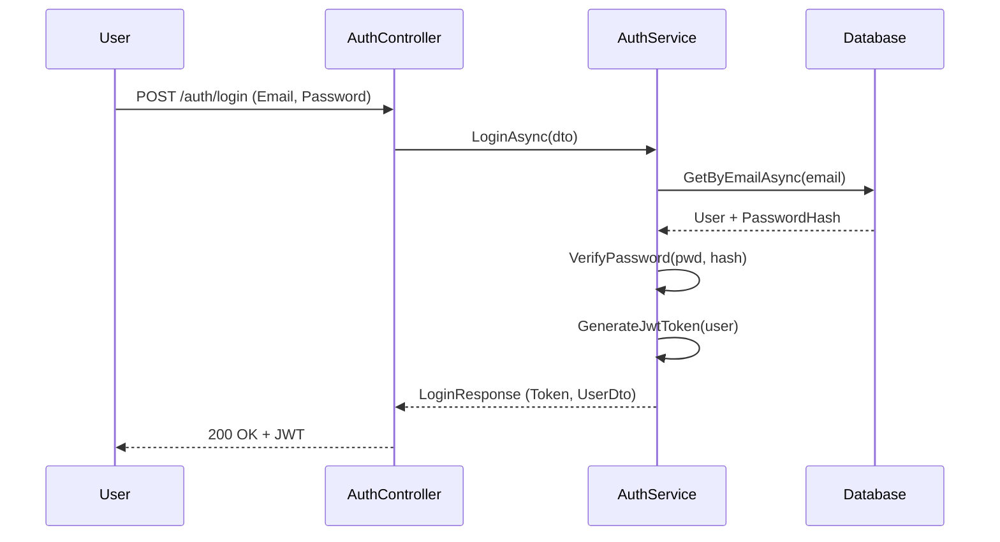

# GreekLearningApp-UserService (.NET) Analysis & Inventory

This analysis covers the legacy **GreekLearningApp-UserService**, an Azure Functions application (Isolated Worker) on .NET 8 that manages user profiles, progress, and settings using Cosmos DB.

---

## 1. API Endpoints Inventory

All endpoints are implemented as Azure Functions with HTTP triggers. Currently, they use `AuthorizationLevel.Anonymous`, delegating authentication to upstream services or representing a security gap to be addressed in the unified backend.

| Function | Route | Method | Description |
| :--- | :--- | :--- | :--- |
| `CreateUser` | `users` | POST | Creates a new user profile with default settings. |
| `GetUsers` | `users` | GET | **Admin Risk:** Lists all user documents in the container. |
| `GetUser` | `users/{id}` | GET | Retrieves a full user document (profile + progress). |
| `UpdateUser` | `users/{id}` | POST | Updates an existing user document. |
| `GetUserLessons`| `users/{id}/lessons` | GET | Retrieves the array of completed lessons for a user. |
| `GetUserWords` | `users/{id}/words` | GET | Retrieves the array of mastered vocabulary for a user. |
| `GetUserSettings`| `users/{id}/settings` | GET | Retrieves user preferences (Dark Mode, Translation). |

---

## 2. Core Business Logic

### Data Models (`User.cs`)
The service uses a document-oriented approach, embedding progress and settings within the `User` root entity.

*   **`User`**: Root object containing `Id`, `Name`, `Progress`, and `Settings`.
*   **`UserProgress`**: Manages arrays of `Lesson` and `Vocab` objects.
*   **`Lesson`**: Tracks `LessonId` and `IsComplete` status.
*   **`Vocab`**: Tracks `WordId` and `IsComplete` status.
*   **`UserSettings`**: Stores `PrefersDarkMode` (bool) and `Translation` (string, e.g., "esv").

### Logic Characteristics
- **Implicit Defaults:** `CreateUser` initializes new users with `PrefersDarkMode = false` and `Translation = "esv"`.
- **Minimal Validation:** Relies on C# 8+ nullable reference types and basic null checks in the function bodies.
- **DTO Strategy:** Uses a separate `ResponseUser` class to return only the `Id` upon creation/update to minimize data exposure.

---

## 3. Database Interactions

### Cosmos DB Strategy
The service uses Azure Cosmos DB as its primary data store.
- **Database/Container:** `koineUsers` / `user-container`.
- **Partition Key:** `id` (User ID).
- **Bindings:** Extensively uses `CosmosDBInput` and `CosmosDBOutput` attributes for declarative data access.

**Security Observation:** There is no "soft delete" or audit trail logic implemented; `UpdateUser` performs a full document replacement.

---

## 4. Key Features

1.  **Profile Management:** Basic CRUD operations for user identities.
2.  **Progress Tracking:** Centralized store for what a user has learned (lessons and words). This is the "User State" consumed by the Reader and Study services.
3.  **User Preferences:** Persistent storage for UI settings (Dark Mode) and preferred biblical translation.

---

## 5. Security & Compliance Gap Analysis

The legacy `GreekLearningApp-UserService` **lacks** several critical security features that are being addressed in the **Unified Backend (`backend/`)**:

*   **Authentication:** No `/login`, `/register`, or `/refresh` endpoints exist in this codebase.
*   **JWT:** No token generation or validation logic is present.
*   **Password Security:** No password hashing or management; it is assumed user identity is managed elsewhere.
*   **RBAC:** No role checks; `GetUsers` (list all) is publicly accessible if the endpoint is exposed.

---

## Authentication Flow (Target Unified Backend)

Since the legacy service is anonymous, the following represents the authentication flow implemented in the **Unified Backend** (`backend/Koine.Application/Services/AuthService.cs`) which will eventually replace this service:



### Security-Critical Code (Unified Backend Implementation)

The following logic from `backend/Koine.Application/Services/AuthService.cs` demonstrates the JWT generation and password verification being adopted for the unified system:

```csharp
private string GenerateJwtToken(User user)
{
    var tokenHandler = new JwtSecurityTokenHandler();
    var key = Encoding.UTF8.GetBytes(_configuration["JwtSettings:SecretKey"]!);
    
    var tokenDescriptor = new SecurityTokenDescriptor
    {
        Subject = new ClaimsIdentity(new[]
        {
            new Claim(ClaimTypes.NameIdentifier, user.Id.ToString()),
            new Claim(ClaimTypes.Email, user.Email),
            new Claim(ClaimTypes.Name, user.Username)
        }),
        Expires = DateTime.UtcNow.AddDays(7),
        Issuer = _configuration["JwtSettings:Issuer"],
        Audience = _configuration["JwtSettings:Audience"],
        SigningCredentials = new SigningCredentials(
            new SymmetricSecurityKey(key), 
            SecurityAlgorithms.HmacSha256Signature)
    };

    var token = tokenHandler.CreateToken(tokenDescriptor);
    return tokenHandler.WriteToken(token);
}

// NOTE: The implementation currently uses a placeholder Base64 "hash".
// A production migration must implement Argon2 or BCrypt here.
private bool VerifyPassword(string password, string hash)
{
    var testHash = Convert.ToBase64String(Encoding.UTF8.GetBytes(password));
    return testHash == hash;
}
```