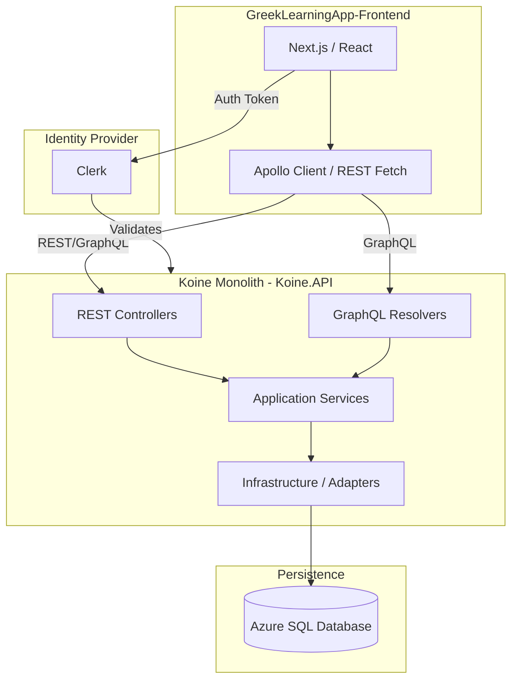

# System Overview: Greek Learning App (Koine)

## Architecture Overview
The Koine system is designed as a modern, full-stack application for studying Ancient Greek. It transitions from a microservices architecture to a consolidated monolith for improved developer productivity and simplified deployment.

## Core Components

### 1. Frontend (Next.js)
The frontend is built with Next.js 14+, leveraging React components, Tailwind CSS (or Vanilla CSS per local preference), and Clerk for authentication. It handles the rendering of Greek text with complex formatting and interactive learning features.

### 2. Backend Monolith (.NET 10)
The backend is a C# .NET 10 application organized using Hexagonal Architecture.
- **Koine.API**: Handles HTTP requests, GraphQL queries, and JWT validation.
- **Koine.Application**: Contains the business logic for reading, lessons, and vocabulary.
- **Koine.Domain**: Defines the core entities (Books, Chapters, Words, Users).
- **Koine.Infrastructure**: Manages database access via Entity Framework Core.

### 3. Database (Azure SQL)
A relational database stores the Greek text data (parsed from OpenGNT or similar sources), user profiles, progress tracking, and lesson content.

## Key Data Flows

### Reading a Text
1. User selects a Book and Chapter in the UI.
2. Frontend requests Chapter data (Words, Morphology, Translations).
3. Backend fetches data from SQL, applies business logic (e.g., highlighting learned words), and returns the payload.
4. Frontend renders the interactive Greek text.

### Study Session (Flashcards)
1. User starts a practice session for a Vocabulary Set.
2. Frontend requests due cards from the backend.
3. User interacts with cards (Flip, Rate).
4. Results are sent to the backend to update Spaced Repetition (SRS) data in the database.
