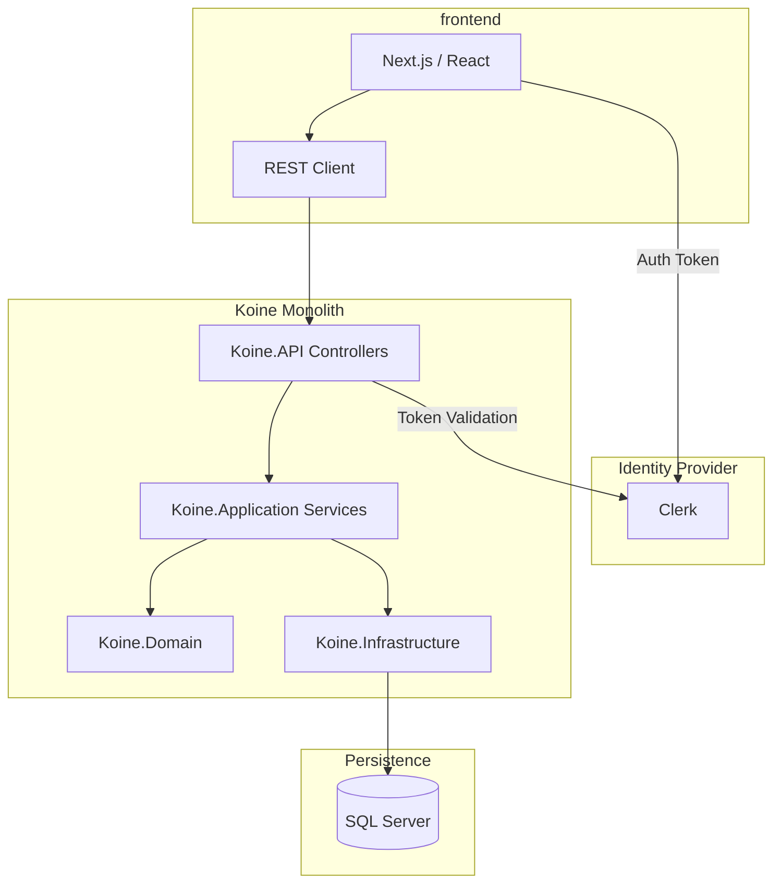

# System Overview: Greek Learning App (Koine)

## Architecture Overview
Koine is a full-stack monolith deployment model: Next.js frontend plus a layered .NET backend.

## Core Components

### 1. Frontend
- Next.js app in `frontend/`
- Reader, study, vocabulary, lessons routes
- Shared API utilities under `src/lib`

### 2. Backend
- .NET 10 solution in `backend/`
- `Koine.API`: HTTP API and middleware
- `Koine.Application`: use-case/services orchestration
- `Koine.Domain`: entities/value objects
- `Koine.Infrastructure`: EF Core data access and external adapters

### 3. Data Layer
- SQL Server for text, progress, study sessions, and lessons
- Seed pipeline driven by backend seeding + `data/` scripts

## Key Data Flows

### Reading a Text
1. Frontend requests chapter/reader data.
2. API delegates to application reader services.
3. Infrastructure queries SQL and returns DTOs.
4. Frontend renders adaptive content.

### Study Session
1. Frontend requests due items/session state.
2. API updates progress through study services.
3. Scheduler state persists in SQL via infrastructure repositories.
